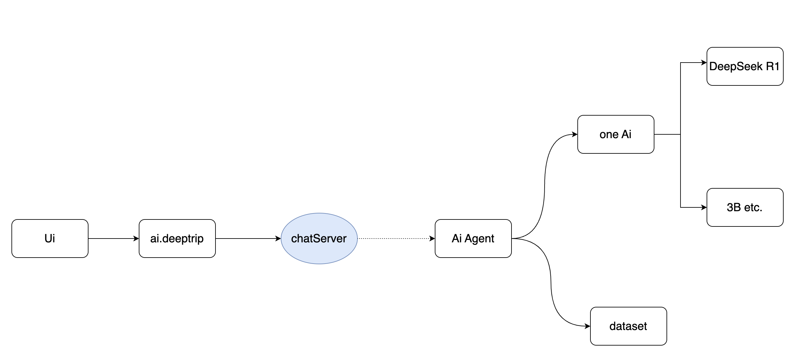
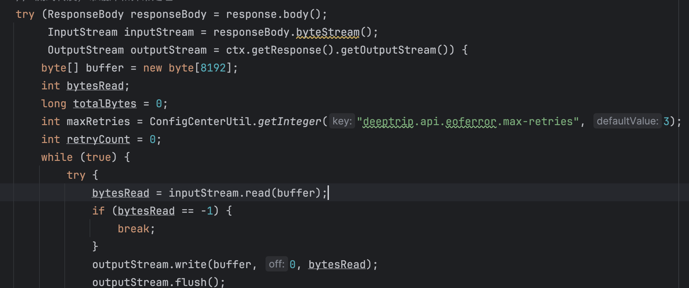
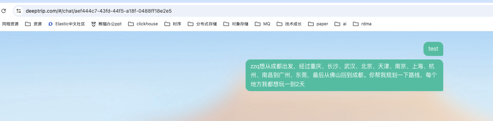

# ChatSSE 断线重连设计方案

## 文档信息

- 来源：17u 内部 Wiki（fileId: d30a3e10684f47268f955fac361eb832）
- 整理：徐凯旋
- 更新时间：2026-04-15

---

## 目录

1. [背景](#一背景)
2. [目标](#二目标)
3. [方案](#三方案)
4. [DeepTrip 升级路线](#四deeptrip-升级路线)

---

## 一、背景

### 1.1 当前架构


| 层级 | 服务 | 职责 |
|------|------|------|
| 中间层 | Java `ai.deeptrip` | 登录、转发聊天等业务逻辑 |
| 算法服务 | Python `ai.agent.deeptrip` | 调用大模型、润色数据、补齐数据 |
| 算力层 | oneai | 提供算力、模型等能力 |
| 数据层 | dataset | 数据集 |

### 1.2 当前进入 chat 后的逻辑

进入 chat 后：

1. **查询历史**：调用 `query_chat_history`，数据落在 ES 中，响应会按顺序拼接业务 history 响应给端上
2. **发起新 query**：
   - 调用 `hotel_chat` 接口，建立长连接
   - 通过 stream 向客户端推送润色后的数据（思考过程等）
   - 整体数据结束后，落入 ES，供下次 `chat_history` 使用

### 1.3 优缺点分析

**优点**

- 简单，业务逻辑可快速落地和验证效果
- 异常 case 属于少数情况时，整体影响可控

**缺点**

- 整个 query 结束后才落 ES，一旦出现弱网、非预期断连等问题，当前生成的 query 无结果，体验差
- ai agent 项目太重，包含了调用大模型、数据润色、业务对接、聊天记录等所有逻辑
- 一次 query 绑定在一个长连接中，流程链路很长，没有中间数据，**不具备事后重连（恢复）能力**

> 对比 DeepSeek：刷新后可继续推送；网络异常后 query 可继续后台处理，刷新 UI 后仍能拿到结果

---

## 二、目标

1. **异常处理能力**：刷新界面或进入之前 query 未结束的 chat，可以继续收到推送
2. **稳定推进**：DeepTrip 项目刚上线且处于前期引流阶段，稳定性是第一要素，**改动要可插拔、可回滚**
3. **推送性能**：保障最高的推送性能

---

## 三、方案

### 3.1 当前逻辑


### 3.2 建议方案



参考 DeepSeek 支持一个 query 同时在多个端推送的能力，需要在服务端引入独立的 chatServer 解耦底层模型与端上交互。

DeepTrip 现有优势：Java 中间层已承担部分业务处理逻辑，解放了 ai agent 的部分任务。

基于可插拔、可回滚的目标，不选择直接改动中间层与 agent 侧代码。DeepTrip 场景可视为典型的**一对一单聊场景**（类似客服、IM 等），相关能力具备复用价值。

---

### 3.3 chatServer 设计

#### 协议

v1 兼容 DeepTrip：HTTP 1.1 keep-alive，以 `type=finish` 结尾。


#### 接口清单

| 接口 | 说明 | 状态 |
|------|------|------|
| `chat` | 主聊天接口（对标 hotel_chat / DeepSeek completion） | ✅ |
| `chat_history` | 查询某个聊天的所有历史记录 | ✅ |
| `resume_stream` | 重新推送最后一条数据（UI 刷新/网络异常场景） | ✅ |
| `stop_stream` | 停止当前推送（是否终止与服务端交互待定） | 待定 |
| `continue_stream` | 用户手动终止后重新继续推送 | 待定 |

#### 核心数据结构

- **Message**：客户端发送的一次 chat 内容 + 服务端对本次 chat 响应的完整数据（直到 finish）
- **Offset**（可选）：用户主动终止推送时已推送的 offset，用于后续继续推送

---

### 3.4 chatServer 核心设计

**核心目标**：推送的实时性，暂不考虑存储不可用的极端情况。

#### 现有推送逻辑



中间层起桥梁作用，将 ai agent 响应的数据（最大 8K）直接转给客户端，无额外逻辑，推送效率较高。

引入 chatServer 需要解决两个难点：

1. **实时性问题**：chatServer 不能像普通消息系统一样等一条完整消息处理后再存储推送，否则整体性能受较大影响
2. **分布式 resume_stream**：需支持多端同时打开一个 query 的推送，且在刷新等场景下都能完成 resume，不能影响推送效率

#### 架构


```
Client（多端）
    ↕ SSE 长连接
ChatServer ──── 镜像传输 byte[] ────→ MsgServer
    ↑                                      ↓
ai agent                               DCDB（历史会话/消息记录）
                                            ↑
                                         Redis（msgId → msgServerIp 映射）
```

| 组件 | 职责 |
|------|------|
| **ChatServer** | 处理客户端连接、做反向推送；将服务端响应数据镜像传给 MsgServer（byte[] 复用） |
| **MsgServer** | 解析 byte[] 成消息，存入 DCDB；处理 `resume_stream` 请求；逻辑较重，独立部署方便迭代 |
| **DCDB** | 核心消息存储（历史会话、历史记录） |
| **Redis** | 缓存 `msgId → msgServerIp` 映射，供 resume_stream 定向路由 |

#### chat 接口

- 入参：`chatId`、`query`
- ChatServer 解析服务端数据，**同时开启两个 stream**：向客户端写入 + 向 MsgServer 写入
- 向客户端写入失败：关闭客户端 stream，**不影响 ai agent 后续生成**
- 向 MsgServer 写入失败：一期先忽略，二期评估降级方案

#### resume_stream 接口

- 入参：`chatId`
- 通过 `msgId` 从 Redis 获取对应 msgServer（获取不到则认为 msg 已结束，直接域名随机重定向）
- 建立 `客户端 → ChatServer → MsgServer` 长连接，支持反向推送
- MsgServer 将整条 msg 完整缓存在内存中，解析到 msg 结束时存入 DCDB
- 所有 resume 请求从内存中该 msg 的 byte[] 头开始推送，直到消息结束
- **并发场景**（正好 msg 结束时 resume 请求到达）：直接查 DCDB 推送给客户端

**好处**：推送性能高，不受客户端数量限制，可实现 DeepSeek 效果。

#### stop 接口

- 入参：`status`（是否终止大模型）

---

## 四、DeepTrip 升级路线

### V1：仅后端升级（可插拔、可回滚）

#### 核心变动

- 插入式，可回滚
- 中间层新增统一配置项 `chatServer`
  - 默认：转发到现有 aiagent
  - 可配置：转发到新 chatServer

#### 好处

- 保留现有所有能力
- 通过中间层配置随时回滚，风险可控
- aiagent 侧无任何感知

#### 实施细节（2025-03-24 调整：动作尽量小，快速落地）

1. 新增 chatServer、msgServer
2. 中间层新增一个配置项，切换下游地址（aiagent 还是 chatServer）
3. 前端捕获 Network Error，调用 `resume_stream` 接口，重新完成存量+增量加载

Redis 数据结构：
- `sid status`
- `sid msgServerIp`

---

### V2：前端升级

#### 核心变动

1. 后端变动：`chat_history` 接口新增字段——是否已完成全部数据推送
2. 前端在 `chat_history` 响应时判断是否需要开启流式继续推送最后一条消息，如需要则开启新的 HTTP 长连接补齐数据
3. Network Error 等异常按 DeepSeek 方式展示 UI 提示

#### 好处

1. 后端新增字段，新老兼容
2. 前端新版本上线后，UI 刷新、重新进入 chat 都可得到最佳体验
3. 解决了现有 ai agent 流程依赖中间层往前网络稳定性的问题

#### V1 + V2 完成后的效果




> 包括还没有具体结论的 Network Error，大概率可解。因为数据生成已不依赖中间层往前的所有网络。

---

### V3：ai agent 瘦身

保留算法等能力，踢除聊天记录、存储等能力，简化代码。
