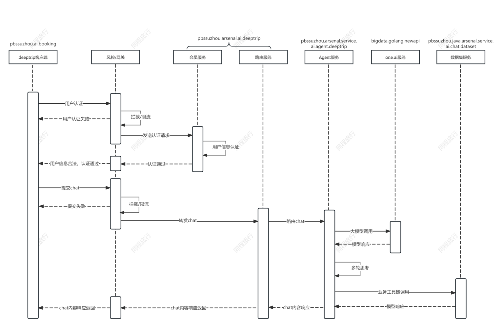
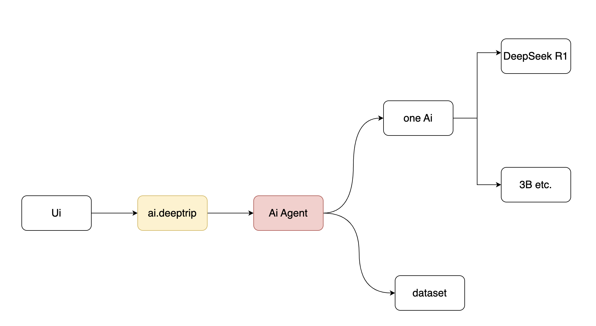
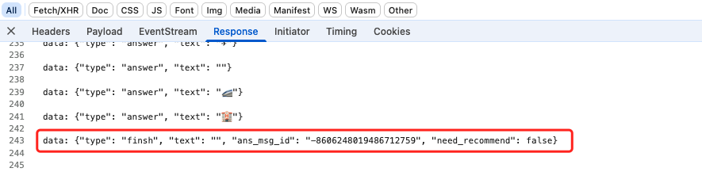
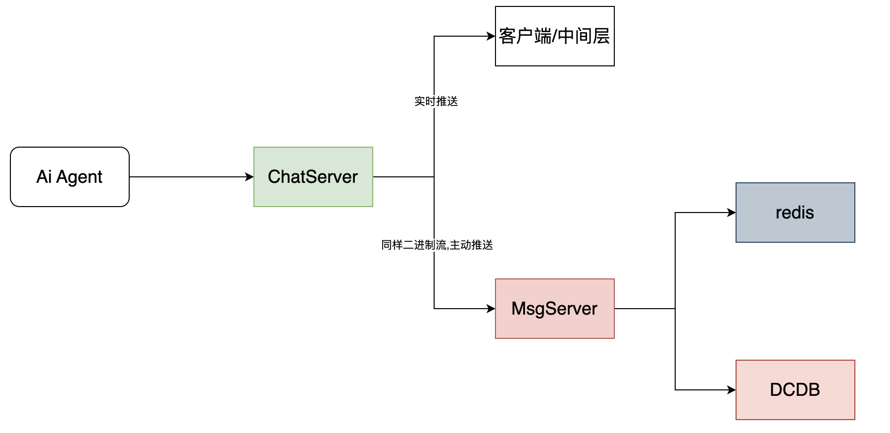
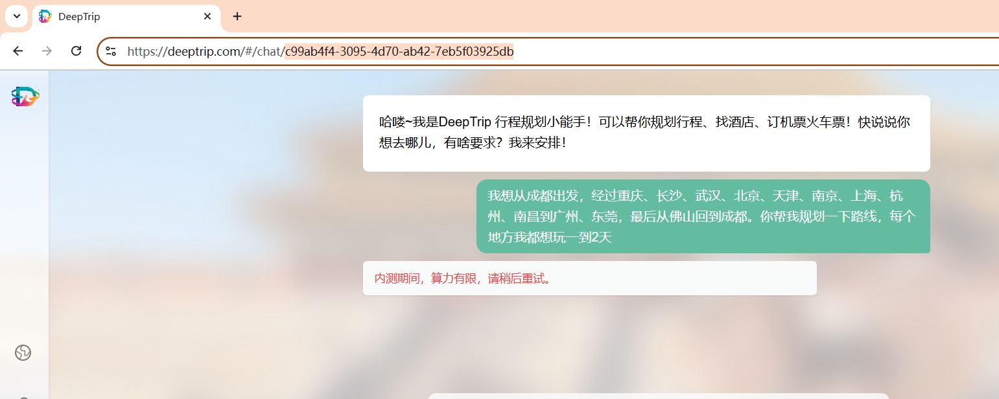

## 1. 背景

### 当前架构

系统架构: 
中间层: java ai.deeptrip  负责 登录,转发聊天等其它逻辑
算法服务: python ai.agent.deeptrip 负责调用大模型,润色数据以及补齐数据
oneai: 负责提供算力,模型等能力
dataset: 数据集

### 当前进入chat后的逻辑:

进入chat后
查询该chat的历史: query_chat_history, 数据落在es中,响应会按顺序拼接业务history响应给端上
发起新query
 1. 发起hotel_chat接口,执行chat请求,建立长链接, 通过stream像客户端推送润色后的数据,比如思考过程等
  在整体数据结束后,记录存入的es中,待下次chat_history使用
### 优点

简单,业务逻辑可快速落地,验证效果。因为异常case属于少数情况。
### 缺点

整个query结束后,落地es, 如当中有任何的问题,如弱网网络异常,非预期外的连接等情况,当前生成的query会没有结果,且体验较差

ai agent项目太重,包含了调用大模型,数据润色,业务对接,聊天记录相关的逻辑
### 原因

从断到中间层到aiagent等,一次query是绑定在一个长链接中,且流程链路很长,而且没有中间数据,不具备事后重连(恢复)等能力,如DeepSeek的刷新可继续推送能力,如DeepSeek的网络异常后,该次query可继续后台处理,刷新ui后可以仍然拿到结果
## 2. 目标

具备异常处理能力:如刷新界面,进入一个之前query未结束chat,可以继续收到推送
稳定推进: deeptrip项目刚上线,且在前期引流阶段,稳定性是第一要素,改动要可插拔,可回滚
推送性能: 要保障最高的推送性能

## 3. 方案

当前逻辑

建议方案

如DeepSeek可支持一个query同时在多个端上同时推送,必然也存在一个server端,负责跟端上交互,解耦底层模型。

现在有优势,DeepTrip有一个java中间层来做业务处理逻辑,解放了部分ai agent的任务
基于目标,要可插拔,可回滚方案,所以不选择在中间层与agent侧直接改动代码增加逻辑,且deepTrip场景可看做一个典型的一对一的单聊场景,类似的客服,im等场景是否可复用能力

### chatServer

#### chatServer协议

v1: 兼容DeepTrip
Http1.1
keep-alive

以type finsh结尾

#### chatServer接口

chat
主聊天接口,如DeepSeek的completion,DeepTrip的hotel_chat
chat_history
聊天历史接口,查询某个聊天的所有历史记录
resume_stream
重新推送最后一条数据,在未推送完时,ui刷新或者网络异常等场景使用
stop_stream
停止当前推送, 能力待定(是否要终止与服务端的交互)
continue_stream
用户手动终止后,重新继续推送(待定)

#### chatServer核心数据结构

Message
客户端发送的一次chat内容
服务端给这次chat响应的完整的数据,直到finish
Offset??
在用户主动终止推送时已推送的offset,等到后续继续推送(如果要实现继续推送)

### chatServer核心设计

核心目标: 推送的实时性,暂不考虑存储不可用的极端情况
目前推送逻辑:

在中间层架起了桥梁,将ai agent响应的数据最大8k的响应给客户端,没有任何其它逻辑,所以推送效率较高。
所以加入中间层需要解决2个难点:
chatserver 不能跟其它消息系统一样,可以一条完整消息处理,该chat场景下,如果等到一条消息完成,存储推送,则整个性能会受较大影响。
resume_stream 逻辑略复杂,如DeepSeek一样,可以同时多端打开一个query的推送,且在刷新等场景下,都可以完成resume,且是分布式的,如何多端流式输出,而且不能影响推送效率
#### 架构

ChatServer: 负责处理 客户端的连接,做反向推送。以及处理服务端需要推送的数据。同时所有服务端响应的数据镜像传输给MsgServer,如现有代码中的byte[]复用
MsgServer: 负责处理数据, 解析Byte[]成消息,存入DCDB,同时可以处理resume_stream接口(下面会介绍)请求,逻辑相对重,解耦出单独的服务,可以比较容易做变更迭代,chatServer逻辑比较单一,比较轻量
DCDB: 核心消息的存储,如历史会话,该会话的历史记录
Redis:  缓存Msg与处理该MsgServer的关系,方便resume_stream接口定向
#### 核心接口

##### chat接口

    入参: chatId, query
    ChatServer 解析服务端的数据,开启2个stream,往客户端写入与往MsgServer写入。
    往客户端写入失败,则往客户端写入的stream关闭,不影响ai agent的后续生成
    往MsgServer写入失败,一期先忽略,二期看是否降级到本服务解析msg或者其它兜底方案
    (MsgServer收到msg的推送,redis缓存一份 msgId与msgServer的mapping)
##### resume_stream接口

    入参: chatId
    通过msgId,从redis中获取到对应的处理的msgServer(获取不到认为msg已处理结束,直接域名重定向随机选择,排除redis失败极端情况),跟对应的msgServer创建长链接,做成 客户端 -> charServer -> msgServer的长连接,支持反向推送
    msgServer 会将一条msg完整的缓存在内存中,当解析到msg结束,存储dcdb中。
    所有resume请求,从内存该msg的byte[]头开始推送,直到消息结束。(并发场景,正好msg结束,resume请求到达,直接查询dcdb数据推送给客户端)
    好处: 推送性能较高,且不受客户端数的限制,完全可以实现DeepSeek的效果
##### 2.3. stop接口

    入参: status 是否终止大模型
### DeepTrip升级步骤

#### V1, 仅后端升级

##### 核心变动

插入式,可回滚,中间层可新增统一配置项: chatServer
默认转发到现在 aiagent,可配置转发到 新的chatServer
##### 好处

保留了现有所有能力,通过中间层配置,可随时回滚到当前状态风险可控。
aiagent侧无任何感知,如切换到chatServer后,只是建连程序从中间层换成了chatServer

2025-03-24: 调整   存储先不动,动作尽量小,快速落地
新增 chatServer,msgServer
中间层 新增 一个配置项 切换下游地址。 是aigent 还是 chatserver
前端,捕获 Network error? ,  resume_stream接口。重新完成存量+增量加载

redis 数据 sid status, sid msgServerIp
#### V2, 前端升级

##### 核心变动

 1. 后端变动,chat_history接口新增是否之前已完成全部数据推送
 2. 在chat_histroy接口响应时,判断是否需要新增流式的继续推送最后一条消息,如需要开启一个新的http长链接,补齐数据。
 3. network error等异常跟DeepSeek一样,ui提示错误
##### 好处

 1. 后端新增字段返回,新老兼容
 2. 前端新版本上线后,ui的重新刷新,重新进入chat,都可以得到最好的效果
 3. 解决了现在ai agent流程走完还依赖 中间层往前的稳定性 如网络

v1,v2升级完以后,如下体验可解。包括还没具体结果的Network Error大概率可解。因为现在数据生成已不依赖中间层往前的所有网络

#### V3, ai agent调整, 保留算法等能力,聊天记录,存储等能力踢除,简化代码

