# agent-b101 `/chat` 接口核心流程源代码分析

> **配套阅读**：`chat接口内部执行流程详解_基于真实日志_DOC.md`（按真实日志梳理运行时阶段）。本文档是源码版的对照——把每个运行时阶段对应到 `agent-b101` 仓库里具体的文件、类、方法、行号，并配 Python→Java 类比，帮助 Java 背景的同学迅速建立心智模型。
>
> **代码仓库**：`/Users/tcuser/Documents/ideaproject/agent-b101/`
> **入口接口**：`POST /chat`
> **核心目录**：`app/routers/agent_loop/`、`app/routers/llm_functions/`、`app/routers/agent_stream_processer/`、`app/routers/context/`

---

## 0. 阅读前置：Python ↔ Java 速查表

| Python 写法 | Java 等价物 / 说明 |
|---|---|
| `async def foo()` | `CompletableFuture<X> foo()`，函数体是 `suspend`able，必须 `await` 才会推进 |
| `await x` | `x.get()` / `x.join()`，挂起当前协程直到 `x` 完成 |
| `asyncio.gather(t1, t2, ...)` | `CompletableFuture.allOf(...).thenApply(...)`，并发等所有结果 |
| `asyncio.to_thread(f, ...)` | `CompletableFuture.supplyAsync(() -> f(...), ioPool)`，把同步阻塞调用扔到线程池 |
| `async def` + `yield` (AsyncGenerator) | `Flux<String>` (Reactor) / SSE `SseEmitter`，可被 `async for` 边产边消费 |
| `@router.post('/chat')` | `@PostMapping("/chat")`（Spring MVC） |
| `class Foo(Enum)` | `enum Foo` |
| `@dataclass` | Lombok `@Data` / record |
| `threading.Thread(target=...)` | `new Thread(Runnable)`；这里用于在线程里再起一个事件循环 |
| `contextvars.copy_context()` | 类似 `MDC` 上下文复制，传递日志 traceId、langfuse session 等 |
| `from x import y` | 静态导入；模块顶层语句相当于 `static {}` 初始化块 |
| `Optional[X]` / `X | None` | `Optional<X>` |
| `dict` / `list` | `Map<K,V>` / `List<E>` |
| `f"{x}"` | 字符串模板（类似 Java 21 `STR."..."`） |
| `try/except` | `try/catch`；`except Exception as e` 把异常绑到 `e` |
| `re.findall(pat, s, re.DOTALL)` | `Pattern.compile(pat, Pattern.DOTALL).matcher(s)` 全量匹配 |
| `pyqueue.Queue` vs `asyncio.Queue` | 前者是线程安全阻塞队列 (`BlockingQueue`)；后者是协程队列 (`Sinks.Many` 风格) |

记住一个核心隐喻：**Python 的事件循环 = Netty 的 EventLoop；协程 = `CompletableFuture` 的可挂起版本；`async for` = 异步流的 `forEach`**。

---

## 1. 接口入口（HTTP 层）

### 1.1 路由声明

文件：`app/routers/api.py:177-180`

```python
@router.post('/chat')
async def chat(request: Request, params: HotelChatRequest):
    logger.info("dt2.0")
    return await DT_agent_loop_v2(request, params)
```

- FastAPI 的 `@router.post('/chat')` 类似 Spring 的 `@PostMapping("/chat")`。
- `request: Request` 是 FastAPI 的原生请求对象，里面有 `headers`、`cookies` 等。
- `params: HotelChatRequest` 是 Pydantic 模型——相当于 Spring `@RequestBody Dto`，FastAPI 会自动从 JSON body 反序列化并做校验。
- 注意 `async def` + `await`：这个 handler 本身就是协程，最终返回的是一个 `StreamingResponse`（SSE）。

### 1.2 请求参数模型

`HotelChatRequest`（`app/params.py`）关键字段：

| 字段 | 含义（对照 Java DTO） |
|---|---|
| `q` | 用户当前 query 文本 |
| `sid` | session id（会话 ID） |
| `loc` | 用户位置（字符串或 dict） |
| `selected_hotel`、`selected_destination`、`selected_route_id`、`selected_route_scenic_name`、`selected_option_ids` | 用户在 UI 上选中的实体（酒店、目的地、线路、景点、选项） |
| `selected_travel` | 用户希望修改的原行程的 trip ID |
| `travel_commend`、`available_agents` | 前端配置（行程推荐配置、可用 agent 列表） |
| `flight_create_front_param` | 机票创单页带过来的参数（serialId、offerAmount、人数等） |

请求头部分（`init_dt_context` 里取）：

| Header | 含义 |
|---|---|
| `memberId`、`unionId`、`appDeviceId` | 用户身份三元组 |
| `dt-channel` | 渠道（PC / MAIN_MINI / APPLET / TC_APP / WECHAT_PAY_MERCHANT …） |
| `sub_channel` | 子渠道（FLIGHT_PAGE / XBH_YND_PAGE …） |
| `platId`、`language`、`version`、`refid` | 平台、语言、版本、推荐来源 ID |
| `X-ABTest-20250811_dt_thinking_v2` | 思考链路 AB（thinking_AB） |
| `X-ABTest-20250721_dt_join_kefu_agent` | 客服 agent AB（kefu_agent_AB） |
| `x-abtest-bak20251124_dt_2_travel_plan_wx_ab` | 行程规划 AB（travel_route_AB） |
| `x-abtest-bak20251202_flight_agent_v1` / `x-abtest-bak20260105_flight_agentv2_wx` | 机票 agent AB |
| `x-abtest-bak20260105_dt_trainv2_wx` / `_APP` | 火车票 agent AB |

> Java 类比：所有 AB 开关都是从请求头读，类似 Spring 拦截器拿 `X-AB-*` 然后塞进 `RequestAttribute`。

---

## 2. 顶层编排：`DT_agent_loop_v2`

文件：`app/routers/agent_loop/DT_agent_loop_v2.py:4164` 起。

这是整个 `/chat` 的真正“Controller 服务方法”，但它特别在两个地方：
1. **跨线程**——Agent 主循环跑在专门的 daemon 线程里，自己有一个独立的事件循环；
2. **双流合并**——Agent 主流 + 外部"思考润色"通道合并到同一个 SSE 输出。

### 2.1 全景结构

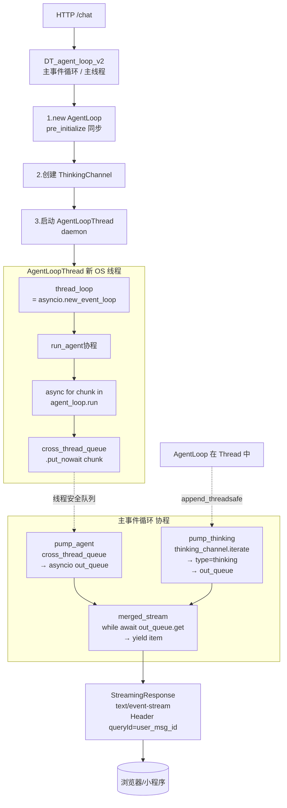

### 2.2 关键代码节选（含逐行注释）

`DT_agent_loop_v2.py:4164-4264`：

```python
async def DT_agent_loop_v2(request: Request, params: HotelChatRequest):
    try:
        from app.routers.agent_loop.thinking_channel import ThinkingChannel
        loop = asyncio.get_running_loop()                # ← 主事件循环引用
        agent_loop = AgentLoop(request, params, thinking_channel=None)
                                                          # ↑ pre_initialize 在 __init__ 里同步跑
        if not getattr(agent_loop.context, 'memberId', ''):
            # 兜底：memberId 为空时直接给前端 finsh: error
            ...
            return StreamingResponse(error_generator(), media_type='text/event-stream')

        thinking_channel = ThinkingChannel(
            loop=loop,
            enable_polish=True,
            message_id=getattr(agent_loop.context, 'message_id', ''),
            session_id=getattr(agent_loop.context, 'session_id', ''),
            langfuse=getattr(agent_loop.context, 'langfuse', None),
        )
        agent_loop.thinking_channel = thinking_channel    # 回填给 agent_loop
        query_id = agent_loop.context.user_msg_id          # SSE Header 用

        async def merged_stream():
            out_queue: asyncio.Queue = asyncio.Queue(maxsize=200)
            ...
            cross_thread_queue: pyqueue.Queue = pyqueue.Queue(maxsize=200)

            def agent_thread_target():                     # ← 在新线程里跑
                thread_loop = asyncio.new_event_loop()     # 新事件循环（线程局部）
                asyncio.set_event_loop(thread_loop)
                async def run_agent():
                    try:
                        async for chunk in agent_loop.run():
                            cross_thread_queue.put_nowait(chunk)
                    finally:
                        cross_thread_queue.put_nowait({"__agent_done__": True})
                                                          # ↑ 哨兵：通知主线程 agent 跑完了
                ...

            current_context = contextvars.copy_context()  # 复制 contextvars
            agent_thread = threading.Thread(
                target=current_context.run,                # 用 contextvars 包一层
                args=(agent_thread_target,),
                name="AgentLoopThread",
                daemon=True
            )
            agent_thread.start()

            async def pump_agent():                        # 把 pyqueue → asyncio.Queue
                while True:
                    try:
                        item = cross_thread_queue.get_nowait()
                    except pyqueue.Empty:
                        await asyncio.sleep(0.05)
                        continue
                    if isinstance(item, dict) and item.get("__agent_done__", False):
                        thinking_channel.close()           # ← agent 完成顺带关闭思考流
                        break
                    await out_queue.put(item)

            async def pump_thinking():                     # 把思考流封装成 SSE
                async for item in thinking_channel.iterate():
                    data = "data: " + json.dumps({
                        "type": "thinking",
                        "text": item.get("text", ""),
                    }, ensure_ascii=False) + "\n\n"
                    await out_queue.put(data)

            task_agent = asyncio.create_task(pump_agent())
            task_think = asyncio.create_task(pump_thinking())

            try:
                while True:
                    if task_agent.done() and task_think.done() and out_queue.empty():
                        break
                    try:
                        item = await asyncio.wait_for(out_queue.get(), timeout=0.5)
                        yield item                         # ← 这里就是 SSE chunk
                    except asyncio.TimeoutError:
                        continue
            finally:
                # 清理：取消任务、关闭通道、回收线程
                ...

        return StreamingResponse(
            merged_stream(),
            media_type='text/event-stream',
            headers={"queryId": query_id}
        )
```

### 2.3 Java 视角的关键设计点

| 设计 | Python 实现 | Java 等价物 |
|---|---|---|
| 跨线程 + 异步 | `threading.Thread` + `asyncio.new_event_loop()` | 自己起 `Thread`，在里面跑一个 `ExecutorService` / Reactor `Scheduler.parallel()` |
| 跨线程队列 | `queue.Queue` | `BlockingQueue<T>` |
| 协程内队列 | `asyncio.Queue` | `Sinks.Many<T>` / `Flux.create` |
| 上下文跨线程 | `contextvars.copy_context()` | `ScopedValue` / `InheritableThreadLocal` |
| SSE 输出 | `StreamingResponse(media_type='text/event-stream')` | `SseEmitter` / `Flux<ServerSentEvent>` |
| 哨兵关流 | `{"__agent_done__": True}` 字典 | `Poison Pill` / `Sinks.complete()` |

> 为什么要把 Agent 主流跑在另一个线程？
> **答**：Agent 内部会做大量 CPU/同步阻塞操作（工具调用、Redis、ES、Milvus 同步 IO），如果直接跑在主事件循环上会卡住 SSE 输出。把它扔进另一个线程的事件循环里，再用队列搬运结果，主事件循环就只负责"喂数据给客户端"，吞吐稳定。

---

## 3. `AgentLoop` 类骨架

文件：`app/routers/agent_loop/DT_agent_loop_v2.py:100-2065`（整个类约 2000 行）。

### 3.1 `__init__`：构造 & 同步预初始化

`DT_agent_loop_v2.py:103-162`

```python
class AgentLoop:
    def __init__(self, request, params, thinking_channel=None):
        self.request = request
        self.params = params
        self.context = None                # 业务上下文，由 init_dt_context 填充
        self.item_recs = None              # ItemRecs：选项/线路推荐数据
        self.llm_model_name = "deepseek-v3"
        self.tool_desc = []
        self.has_tool_result = False
        self.llm_inference_messages = []   # 下一轮 LLM 输入 messages
        self.processor = None              # AgentStreamProcessor
        self.current_state = None          # LoopState 枚举
        self.last_agent_state = None       # 上一轮非推理状态
        self.customer_service_agent_dispatch = False
        self.hotel_agent_dispatch = False
        self.hotel_agent_enabled = False
        self.language_message_sent = False
        self.first_prompt = None           # PromptGenerator
        self.in_loop_prompt = None
        self.middle_user_prompt = None
        self.middle_loop_prompt = None
        self.final_answer_prompt = None
        self.hotel_agent_dispatch_prompt = None
        self.customer_service_agent_dispatch_prompt = None
        self.flight_page_info_prompt = None
        self.DEEPSEEKR1_CONTEXT_LENGTH = 128*1024*2.1
        self.MAX_DEPTH = 7                 # ★ 工具调用最大深度
        self.timing_tracker = TimingTracker()
        self.thinking_channel = thinking_channel
        self.pre_initialize()              # ← 同步调用
```

Java 类比：`AgentLoop` 类似一个一次性的 Spring `@RequestScope` Bean，封装一次会话的状态机；构造时立即跑一次同步初始化（建 context、写用户消息到 Redis）。

### 3.2 `pre_initialize`：同步阶段

`DT_agent_loop_v2.py:164-198`

```python
def pre_initialize(self) -> bool:
    self.timing_tracker.start_timing("init_dt_context")
    self.context = init_dt_context(self.request, self.params)     # ★ Step 1
    self.timing_tracker.end_timing("init_dt_context", "init_dt_context")

    user_msg = Message(                                            # ★ Step 2
        role="user",
        content=self.context.original_query,
        conversation_id=self.context.session_id,
        user_id=self.context.memberId,
        plat_id=self.context.platId,
        msg_type=MESSAGE_TYPE_TEXT,
        dt_channel=self.context.dt_channel,
        sub_channel=self.context.sub_channel,
        refid=self.context.refid,
        chat_text_input_source=self.context.chat_text_input_source,
        user_loc=self.context.user_location
    )
    user_msg_id = user_msg.get_message_id()
    self.context.user_msg_id = user_msg_id
    insert_conversation_message(user_msg)                         # ★ Step 3：写 ES/MQ

    if self.context.user_msg_id:
        kv_save(self.request, self.context.session_id,
                'latest_user_msg_id',
                json.dumps({'val': self.context.user_msg_id,
                            'query': self.context.query},
                           ensure_ascii=False))                   # ★ Step 4：写 Redis
```

三件事：
1. **`init_dt_context`**：构建会话上下文（详见 §4）
2. **创建并落库用户 Message**：插到对话表（ES）、并通过 MQ 异步同步
3. **`latest_user_msg_id` 写 Redis**：给后续可能的"重发 / 流式重连"提供索引

### 3.3 `initialize`：异步阶段（含 7 并发分析）

`DT_agent_loop_v2.py:199-411`，关键步骤：

```
1. 绑定 thinking_channel 到 context
2. REVERSE_TRAVEL 活动快速路径（跳过路由与意图分析）
3. choiced_hotel + search_hotel_detail_by_id 工具 → 预加载酒店详情
4. ItemRecs(...) 初始化（线路/选项推荐数据源，基于 Redis 缓存）
5. selected_route_id → 从 ItemRecs 拉历史推荐数据，拼接背景到 query
6. selected_option_ids → 同理拼接背景
7. _initialize_prompt_generators()         ← 模块化拼 prompt
8. await _sync_user_memory()               ← Milvus 用户长期记忆（先写后查）
9. await _analyze_user_query()             ← ★ 7 任务并发分析
   - 完成后将 detected_language_code 注入 thinking_channel
   - thinking_channel.append("分析用户需求语言及上下文...")
10. 若 route_manager_result=="inspiration_agent"：重新生成 prompt（灵感场景）
11. 若 route_manager_result=="recent_activity_agent" 且渠道允许：切活动工具
12. _determine_hotel_agent_route()         ← 酒店 agent 分流判定
13. 客服 dispatch 条件判定
```

#### 3.3.1 流程图

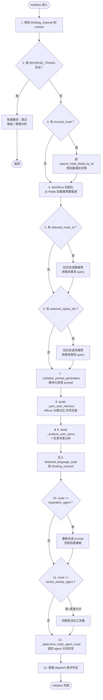

### 3.4 `_initialize_prompt_generators`：模块化 prompt

`DT_agent_loop_v2.py:412` 起。Prompt 是用 `PromptGenerator` 模块化"乐高式"拼装：

```python
self.first_prompt = PromptGenerator([
    "basic","tool_result","working_mechanism","tool","ability",
    ...  # 一串 prompt 模块名
])
# 然后根据 dt_channel / sub_channel 做：
self.first_prompt.replace("basic", basic_prompt_for_wechat_pay)
self.first_prompt.insert_after("tool", flight_page_info_block)
...
```

Java 类比：把 prompt 当作"Spring 多模块拼装的策略组合"，根据请求维度（渠道、AB、agent 类型）替换不同的策略块。

### 3.5 `_analyze_user_query`：7 并发分析的入口

`DT_agent_loop_v2.py:533-628`

```python
async def _analyze_user_query(self):
    query_analysis = await analyze_query_comprehensive(
        message_id=self.context.message_id,
        session_id=self.context.session_id,
        query=self.context.query,                         # 含背景的 query
        selected_travel_context=self.context.selected_travel_context,
        history=self.context.summerized_history_text,
        history_message=self.context.original_chat_history,
        dt_channel=self.context.dt_channel,
        sub_channel=self.context.sub_channel,
        user_address=self.context.user_location,
        version=self.context.version,
        flight_page_info=self.context.flight_page_info,
        langfuse=self.context.langfuse,
        original_query=self.context.original_query,        # 原始 query（语言识别用）
        user_profile_text=getattr(self.context, "user_profile", "") or "",
        user_memory_text=getattr(self.context, "user_memory_text", "") or "",
    )

    # ★ 机票创单页特殊：第一次分到 universal_agent 时，再细分一次
    if self.context.sub_channel == "FLIGHT_PAGE" and query_analysis.get("agent_name") == "universal_agent":
        query_analysis = await analyze_query_comprehensive(...)

    # 把结果灌进 context
    self.context.detected_language       = query_analysis.get("language", "简体中文")
    self.context.detected_language_code  = language2code(self.context.detected_language)
    self.context.intent_list             = query_analysis.get("intent", [])
    self.context.ad_intent               = query_analysis.get("ad_intent", "非广告意图")
    self.context.rewritten_query         = query_analysis.get("rewritten_query", self.context.query)
    self.context.tool_count_predict      = query_analysis.get("tool_count_predict", 1)
    self.context.route_manager_result    = query_analysis.get("agent_name", "未知")
    self.context.route_manager_parameters= query_analysis.get("agent_parameters", "")
    self.context.need_external_knowledge = query_analysis.get("need_external_knowledge", True)
    self.context.search_queries          = query_analysis.get("search_queries",
                                              {"queries": [], "preference": ["relevance"]})
    self.context.query_insight           = query_analysis.get("query_insight", None)
    # 用户记忆仅对机票 agent 生效，其余清空避免污染
    if self.context.route_manager_result != "flight_agent":
        self.context.user_memory_text = ""
    if router_agent_name == "inspiration_agent":
        self.context.update_tools_and_agents_for_inspiration()
```

---

## 4. 上下文初始化：`init_dt_context`

文件：`app/routers/context/dt_context_init.py:131-296`。

### 4.1 工作流

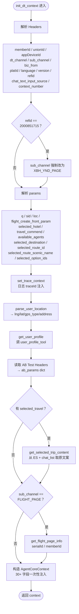

### 4.2 `AgentCoreContext` 关键字段（节选）

构造时传入约 30 个字段（`dt_context_init.py:246-288`），后续在 `initialize` 阶段会继续写入：

- 用户身份：`memberId / unionId / appDeviceId / platId`
- 渠道：`dt_channel / sub_channel / refid / chat_text_input_source / version`
- 位置：`user_location / user_original_address / user_longitude / user_latitude / user_coordinate_type`
- 用户画像：`user_profile`
- 用户输入：`query / original_query`
- AB：`ab_params{thinking_AB, kefu_agent_AB, travel_route_AB}`
- 选择实体：`choiced_hotel / travel_commend / available_agents / selected_destination / selected_route_id / selected_route_scenic_name / selected_option_ids / selected_travel_context`
- 机票创单页：`flight_page_info / offerAmount / canSave / cashBack / adultNum / childNum / babyNum`
- 占位（待 `initialize` 阶段补全）：`detected_language / detected_language_code / intent_list / route_manager_result / rewritten_query / search_queries / query_insight / user_memory_text / summerized_history_text / original_chat_history / NAME_2_TOOL / NAME_2_AGENT / NAME_2_MEM / langfuse / reasoning_tracker / loop_depth`

> Java 类比：`AgentCoreContext` 就是一个超大的"会话级状态对象"，相当于 Spring 的 `@RequestScope` Bean + Redux 中间状态，存放整轮对话需要的所有共享数据。`context.NAME_2_TOOL`、`context.NAME_2_AGENT` 在 `AgentCoreContext` 内部 `__init__` 时根据 `dt_channel` 等装载（类似 SPI / 策略注册表）。

---

## 5. 七任务并发分析：`analyze_query_comprehensive`

文件：`app/routers/llm_functions/analyze_query_comprehensive.py:36-217`。

### 5.1 7 个并发任务

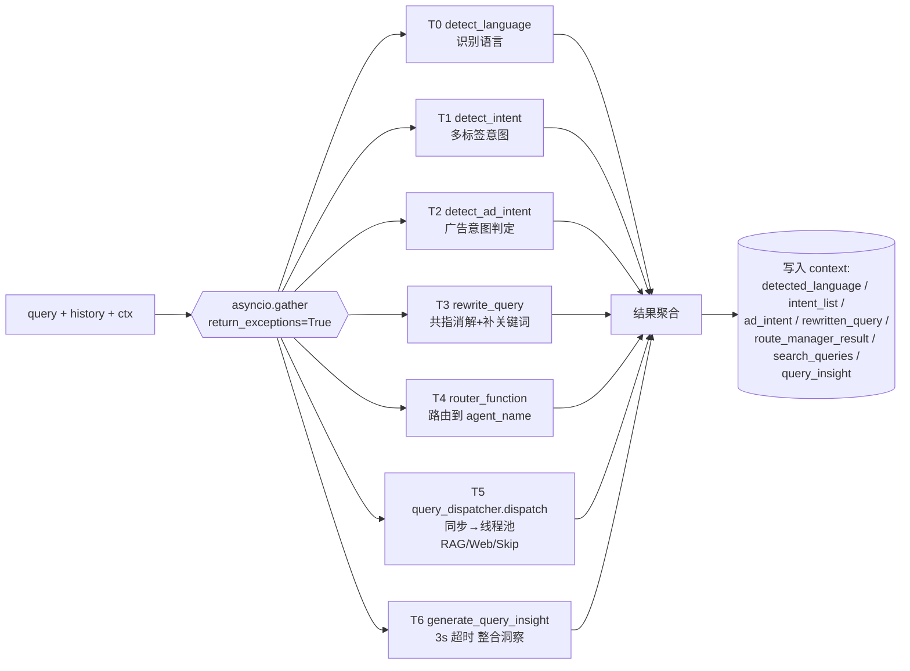

每个 future 失败都不阻断整体（`return_exceptions=True`），失败时各自走兜底默认值。

```python
base_tasks = [
    detect_language(message_id, f"{sid}_lang",     original_query, history),
    detect_intent  (message_id, f"{sid}_intent",   query + query_add, history, history_message),
    detect_ad_intent(message_id, f"{sid}_ad_intent", query, history_message),
    rewrite_query  (message_id, f"{sid}_rewrite",  query, history),
    router_function(message_id, f"{sid}_router",   query, history, history_message,
                    dt_channel, sub_channel, user_address, version,
                    flight_page_info, langfuse),
    asyncio.to_thread(                              # ← 同步函数搬线程池
        query_dispatcher.dispatch,
        query, session_id,
        user_location=user_address,
        user_profile=dispatch_user_ctx or None,
        history=history,
    ),
    generate_query_insight_with_timeout(             # ← 3s 超时，超时返回 None
        message_id, f"{sid}_insight",
        query, user_address, user_profile_text, user_memory_text,
        history, history_message, dt_channel, sub_channel,
        timeout=3.0,
    ),
]

results = await asyncio.gather(*base_tasks, return_exceptions=True)
```

任务 ↔ 含义 ↔ 结果字段对照：

| # | 任务函数 | 作用 | 失败兜底 | 写入 context |
|---|---|---|---|---|
| 0 | `detect_language` | 识别用户语言（"简体中文" / "English" / ...） | "请求错误" | `detected_language` / `detected_language_code` |
| 1 | `detect_intent` | 识别多标签意图列表 | `["请求错误"]` | `intent_list` |
| 2 | `detect_ad_intent` | 识别是否广告意图 | "非广告意图" | `ad_intent` |
| 3 | `rewrite_query` | query 改写（消解共指、补关键词） | 原 query | `rewritten_query` |
| 4 | `router_function` | 路由识别（输出 `agent_name` 和参数） | None | `route_manager_result` / `route_manager_parameters` |
| 5 | `query_dispatcher.dispatch` (同步) | Search Agent 的查询分发（RAG / Web / Skip） | `{queries:[], preference:["relevance"]}` | `search_queries` / `need_external_knowledge` |
| 6 | `generate_query_insight_with_timeout` | 给出整合时间地点用户画像的简短洞察 | None | `query_insight` |

> Java 类比：等价于一次 `CompletableFuture.allOf(...)`，每个 future 失败都不阻断整体（因为 `return_exceptions=True`）。`asyncio.to_thread(dispatch)` 类似把同步阻塞 IO 任务扔到 `BoundedElasticScheduler` 里跑，避免堵塞主事件循环。

### 5.2 结果处理

```python
language_result = results[0] if not isinstance(results[0], Exception) else "请求错误"
intent_result   = results[1] if not isinstance(results[1], Exception) else ["请求错误"]
ad_intent_result= results[2] if not isinstance(results[2], Exception) else "非广告意图"

rewritten_query = query
rewritten_query_result = results[3] if not isinstance(results[3], Exception) else query
if rewritten_query_result and isinstance(rewritten_query_result, str):
    rewritten_query = rewritten_query_result

router_result = results[4] if not isinstance(results[4], Exception) else None
agent_name = "未知"; agent_parameters = ""; router_original_response = ""
if router_result and isinstance(router_result, dict):
    agent_name = router_result.get("agent_name", "未知")
    router_original_response = router_result.get("original_response", "")
    agent_parameters = router_result.get("agent_parameters", "")

search_queries = results[5] if not isinstance(results[5], Exception) else None
if not search_queries or not isinstance(search_queries, dict):
    search_queries = {"queries": [], "preference": ["relevance"]}

need_external_knowledge = not search_queries.get("skip", False)   # ← skip_search 工具

query_insight = None
insight_result = results[6] if not isinstance(results[6], Exception) else None
if insight_result and isinstance(insight_result, str):
    query_insight = insight_result

return {
    "query": query,
    "rewritten_query": rewritten_query,
    "language": language_result,
    "intent": intent_result,
    "ad_intent": ad_intent_result,
    "agent_name": agent_name,
    "agent_parameters": agent_parameters,
    "router_original_response": router_original_response,
    "need_external_knowledge": need_external_knowledge,
    "search_queries": search_queries,
    "query_insight": query_insight,
}
```

---

## 6. 主循环：状态机 `run()`

文件：`app/routers/agent_loop/DT_agent_loop_v2.py:2064-2700`。

### 6.1 `LoopState` 枚举

`DT_agent_loop_v2.py:68-91`

```python
class LoopState(Enum):
    DIRECT_ANSWER                   = "direct_answer"
    DEFAULT_STATE                   = "default_state"
    LLM_INFERENCE                   = "llm_inference"
    TOOL_INTEGRATION                = "tool_integration"
    AGENT_DISPATCH                  = "agent_dispatch"
    AGENT_DELEGATION                = "agent_delegation"
    FLIGHT_AGENT                    = "flight_agent"
    HOTEL_AGENT                     = "hotel_agent"
    TRAIN_AGENT                     = "train_agent"
    ANSWER_PREPARATION              = "answer_preparation"
    POST_PROCESSING                 = "post_processing"
    SIGHT_DESTINATION_RECOMMENDATION= "sight_destination_recommendation"
    ROUTE_RECOMMEND_DIRECT_ANSWER   = "route_recommend_direct_answer"
    TRAVEL_GUIDE_RECOMMENDATION     = "travel_guide_recommendation"
    TRAVEL_PLAN_AGENT               = "travel_plan_agent"
    PRODUCT_PLAN_AGENT              = "product_plan_agent"
    DEEP_THINK                      = "deep_think"
    CHECK_THINK                     = "check_think"
    SUMMARY_THINK                   = "summary_think"
```

> Java 类比：等价于 `enum LoopState { ... }`，状态机的"状态字典"。

### 6.2 初始状态选择（路由）

`DT_agent_loop_v2.py:2113-2261`，按优先级判定（决策树形式）：

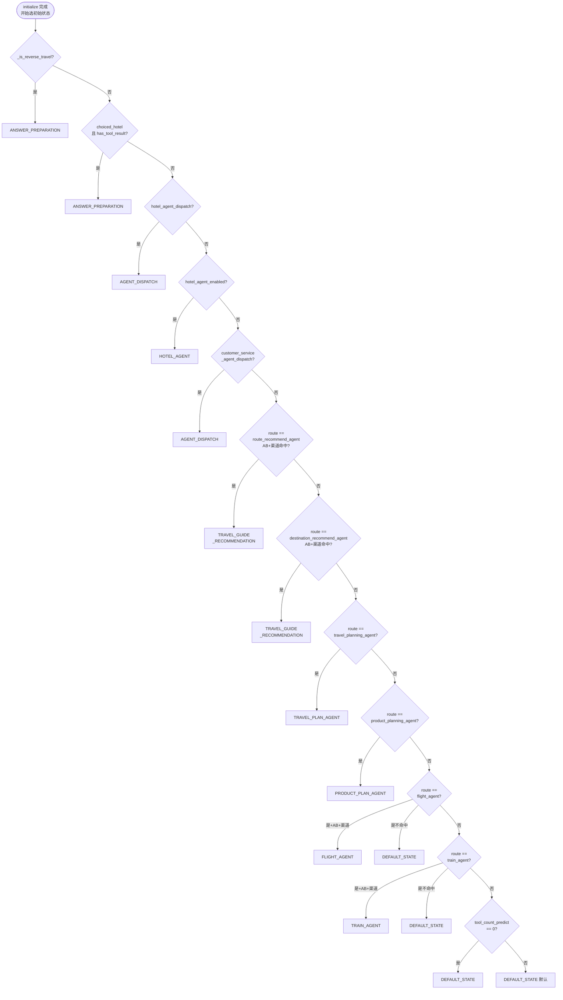

> 注意：`flight_agent` / `train_agent` 都受多套 AB header 和 `dt_channel` 双重约束；APPLET 渠道直接通过，MAIN_MINI / TC_APP 需要 AB 为 "A"。

### 6.3 主循环 dispatcher 状态机

#### 6.3.1 详细状态迁移图

```mermaid
stateDiagram-v2
    [*] --> 路由选状态: initialize 完成

    路由选状态 --> DEFAULT_STATE: 普通对话
    路由选状态 --> HOTEL_AGENT: 酒店分流
    路由选状态 --> FLIGHT_AGENT: 机票分流+AB+渠道
    路由选状态 --> TRAIN_AGENT: 火车分流+AB+渠道
    路由选状态 --> TRAVEL_PLAN_AGENT: 行程规划
    路由选状态 --> PRODUCT_PLAN_AGENT: 产品规划
    路由选状态 --> TRAVEL_GUIDE_RECOMMENDATION: 路线/目的地推荐+AB
    路由选状态 --> AGENT_DISPATCH: 客服/酒店 dispatch
    路由选状态 --> ANSWER_PREPARATION: reverse_travel 或已有工具结果

    state DEFAULT_STATE {
        d1: 旅行规划补充分析 analyze_travel_comprehensive
        d2: 拉搜索 rerank 上下文
        d3: 选 prompt 模板 中文走 first_prompt 否则 in_loop_prompt
        d4: 选模型 主推理 deeptrip-qwen3-30b-a3b
        d5: reset_loop_processor_state
        [*] --> d1 --> d2 --> d3 --> d4 --> d5
    }
    DEFAULT_STATE --> LLM_INFERENCE: messages 准备好

    state LLM_INFERENCE {
        i1: 深度熔断检查 loop_depth 大于 7 直接进 POST_PROCESSING
        i2: Token 检查 + 上下文压缩
        i3: 首次推送 language SSE 整轮一次
        i4: loop_depth +1 + langfuse 入参 trace
        i5: 调 call_model_async_stream 拿流
        i6: AgentStreamProcessor 边解析边 yield SSE
        i7: 流结束 提取 reason_content/ans_content/tool_list/finish/agent
        i8: 按标签产物决定下一状态 详见 8.5
        [*] --> i1 --> i2 --> i3 --> i4 --> i5 --> i6 --> i7 --> i8
    }
    LLM_INFERENCE --> TOOL_INTEGRATION: 出现 tool 标签
    LLM_INFERENCE --> AGENT_DELEGATION: 出现合法 agent 标签
    LLM_INFERENCE --> ANSWER_PREPARATION: 出 ans_content 或 finish 或 depth==MAX
    LLM_INFERENCE --> DEEP_THINK: 行程规划+finish
    LLM_INFERENCE --> CHECK_THINK: 上一轮是 DEEP_THINK
    LLM_INFERENCE --> SUMMARY_THINK: 上一轮是 CHECK_THINK
    LLM_INFERENCE --> ROUTE_RECOMMEND_DIRECT_ANSWER: 出现 re_recommend
    LLM_INFERENCE --> DEFAULT_STATE: 出现 abandon_recommend

    state TOOL_INTEGRATION {
        t1: 等待 tool_board 所有工具完成 带超时
        t2: 构建下一轮 messages 把 observation 拼进去
        t3: 模型继续推理
        [*] --> t1 --> t2 --> t3
    }
    TOOL_INTEGRATION --> LLM_INFERENCE: 工具完成
    TOOL_INTEGRATION --> ANSWER_PREPARATION: depth 超限兜底

    state AGENT_DISPATCH {
        ad1: 切换 prompt 到 hotel_agent_dispatch 或客服 dispatch 模板
        ad2: 改 NAME_2_TOOL/NAME_2_AGENT 到子 agent 工具集
        ad3: 回主推理走子 agent 流程
        [*] --> ad1 --> ad2 --> ad3
    }
    AGENT_DISPATCH --> LLM_INFERENCE

    state DEEP_THINK {
        dt1: 用 thinking 模型深度规划行程
        dt2: 提取 travel 标签内容写入 context
        [*] --> dt1 --> dt2
    }
    DEEP_THINK --> LLM_INFERENCE: 进入下一轮 CHECK_THINK 准备

    state CHECK_THINK {
        ct1: 校验深思考产物 必要时修正
        [*] --> ct1
    }
    CHECK_THINK --> LLM_INFERENCE: 进入 SUMMARY_THINK 准备

    state SUMMARY_THINK {
        st1: 汇总成最终行程文案 summary 标签
        [*] --> st1
    }
    SUMMARY_THINK --> ANSWER_PREPARATION

    state ROUTE_RECOMMEND_DIRECT_ANSWER {
        rr1: 跳过 LLM 直接组装线路推荐答案
        [*] --> rr1
    }
    ROUTE_RECOMMEND_DIRECT_ANSWER --> LLM_INFERENCE

    state SIGHT_DESTINATION_RECOMMENDATION {
        sd1: 景点+目的地组合推荐
        [*] --> sd1
    }
    SIGHT_DESTINATION_RECOMMENDATION --> LLM_INFERENCE

    state TRAVEL_GUIDE_RECOMMENDATION {
        tg1: 攻略式推荐 切对应 prompt
        [*] --> tg1
    }
    TRAVEL_GUIDE_RECOMMENDATION --> LLM_INFERENCE

    state ANSWER_PREPARATION {
        ap1: 拼最终回答的 messages
        ap2: 整理 reasoning_tracker 思考过程
        ap3: 准备落库元数据 tool_list/route_timeline
        [*] --> ap1 --> ap2 --> ap3
    }
    ANSWER_PREPARATION --> POST_PROCESSING

    state FLIGHT_AGENT {
        f1: 调机票子 agent 完整子流程
        f2: 失败置 flight_fallback=true
        [*] --> f1 --> f2
    }
    FLIGHT_AGENT --> POST_PROCESSING: 正常完成
    FLIGHT_AGENT --> DEFAULT_STATE: fallback 剔除机票意图重试

    state HOTEL_AGENT {
        h1: 调酒店子 agent
        h2: 失败置 hotel_fallback=true
        [*] --> h1 --> h2
    }
    HOTEL_AGENT --> POST_PROCESSING: 正常完成
    HOTEL_AGENT --> DEFAULT_STATE: fallback

    state TRAIN_AGENT {
        tr1: 调火车票子 agent
        tr2: 失败置 train_fallback=true
        [*] --> tr1 --> tr2
    }
    TRAIN_AGENT --> POST_PROCESSING: 正常完成
    TRAIN_AGENT --> DEFAULT_STATE: fallback

    AGENT_DELEGATION --> [*]: break 子 agent 独立输出 SSE
    TRAVEL_PLAN_AGENT --> [*]: break
    PRODUCT_PLAN_AGENT --> [*]: break

    state POST_PROCESSING {
        p1: 1.sight SSE
        p2: 2.thinking 落 ES
        p3: 3.埋点 fieldset_check
        p4: 4.banner 五选一
        p5: 5.assistant Message 落库
        p6: 6.发 finsh SSE
        [*] --> p1 --> p2 --> p3 --> p4 --> p5 --> p6
    }
    POST_PROCESSING --> [*]: break 结束流

    note right of LLM_INFERENCE
        每进入一次 loop_depth +1
        超过 MAX_DEPTH=7 强制
        转 ANSWER_PREPARATION 兜底
    end note
```

#### 6.3.2 各状态职责一句话速查

| 状态 | 是否终止 | 一句话职责 |
|---|---|---|
| `DEFAULT_STATE` | 否 | 进入主推理前的"准备工作"：旅行规划补充分析、搜索 rerank、选 prompt/模型、重置 processor |
| `LLM_INFERENCE` | 否 | **核心循环**：调主推理模型、流式解析、依据标签产物决定下一状态 |
| `TOOL_INTEGRATION` | 否 | 等 `tool_board` 工具结果回来 → 拼 `<observation>` 进下一轮 messages |
| `AGENT_DISPATCH` | 否 | 切换到酒店 / 客服 agent 的 prompt + 工具集，再回 LLM 推理 |
| `AGENT_DELEGATION` | **是** | 委派给某个 agent 完整接管，自己 yield SSE 后 break |
| `DEEP_THINK` | 否 | 用 thinking 模型对行程做深度规划，产出 `<travel>` |
| `CHECK_THINK` | 否 | 校验 / 修正深思考的行程产物 |
| `SUMMARY_THINK` | 否 | 把行程汇总成最终文案 `<summary>` |
| `ROUTE_RECOMMEND_DIRECT_ANSWER` | 否 | 跳过 LLM 直接拼线路推荐答案（命中缓存/直答场景） |
| `SIGHT_DESTINATION_RECOMMENDATION` | 否 | 景点+目的地组合推荐子流程 |
| `TRAVEL_GUIDE_RECOMMENDATION` | 否 | 攻略式推荐（路线/目的地推荐 + AB 命中） |
| `ANSWER_PREPARATION` | 否 | 整理最终回答 messages、reasoning_tracker、落库元数据 |
| `FLIGHT_AGENT` | **是\*** | 机票子 agent 子流程；失败可 fallback 回 DEFAULT_STATE |
| `HOTEL_AGENT` | **是\*** | 酒店子 agent；同上 fallback |
| `TRAIN_AGENT` | **是\*** | 火车票子 agent；同上 fallback |
| `TRAVEL_PLAN_AGENT` | **是** | 行程规划子 agent 完整接管输出 |
| `PRODUCT_PLAN_AGENT` | **是** | 产品规划子 agent 完整接管输出 |
| `POST_PROCESSING` | **是** | 终态兜底：6 步收尾 + 发 `finsh` SSE |

> `*` 标 fallback：子 agent 内部失败时把 `*_fallback=True` 置位，主循环看到后会 `continue` 退回 `DEFAULT_STATE` 重走主推理。

#### 6.3.3 代码骨架（保留）

`DT_agent_loop_v2.py:2263-2470`，简化结构：

```python
while True:
    if self.context.loop_depth > self.MAX_DEPTH:
        break                                            # 超深度强制结束

    if self.current_state == LoopState.LLM_INFERENCE:
        async for chunk in self._handle_llm_inference_state():
            yield chunk
    elif self.current_state == LoopState.DEFAULT_STATE:
        await self._handle_default_state()
    elif self.current_state == LoopState.AGENT_DISPATCH:
        await self._handle_agent_dispatch_state()
    elif self.current_state == LoopState.TOOL_INTEGRATION:
        await self._handle_tool_integration_state()
    elif self.current_state == LoopState.AGENT_DELEGATION:
        async for chunk in self._handle_agent_delegation_state():
            yield chunk
        break                                            # 终止状态
    elif self.current_state == LoopState.TRAVEL_PLAN_AGENT:
        async for chunk in self._handle_travel_plan_agent_state():
            yield chunk
        break
    elif self.current_state == LoopState.PRODUCT_PLAN_AGENT:
        ... break
    elif self.current_state == LoopState.FLIGHT_AGENT:
        async for chunk in self._handle_flight_agent_state():
            yield chunk
        if self.flight_fallback:                         # ★ fallback 机制
            yield thinking_chunk("机票助手无法处理，正转交主流程")
            self.current_state = LoopState.DEFAULT_STATE
            self.context.intent_list = [i for i in self.context.intent_list
                                        if i not in ("机票","flight","飞机票")]
            continue
        else:
            break
    elif self.current_state == LoopState.HOTEL_AGENT:
        ... 同上 fallback 机制 ...
    elif self.current_state == LoopState.TRAIN_AGENT:
        ... 同上 fallback 机制 ...
    elif self.current_state == LoopState.ROUTE_RECOMMEND_DIRECT_ANSWER:
        await self._handle_re_recommend_direct_answer_state()
    elif self.current_state == LoopState.ANSWER_PREPARATION:
        await self._handle_answer_preparation_state()
    elif self.current_state == LoopState.SIGHT_DESTINATION_RECOMMENDATION:
        await self._handle_sight_destination_recommendation_state()
    elif self.current_state == LoopState.TRAVEL_GUIDE_RECOMMENDATION:
        await self._handle_travel_guide_recommendation_state()
    elif self.current_state == LoopState.DEEP_THINK:
        await self._handle_deep_think_state()
    elif self.current_state == LoopState.CHECK_THINK:
        await self._handle_check_think_state()
    elif self.current_state == LoopState.SUMMARY_THINK:
        await self._handle_summary_think_state()
    elif self.current_state == LoopState.POST_PROCESSING:
        async for chunk in self._handle_post_processing_state():
            yield chunk
        break                                            # 终止状态
```

### 6.4 终止状态汇总

| 状态 | 终止后操作 |
|---|---|
| `AGENT_DELEGATION` | 委派给子 agent 完成后 `break` |
| `TRAVEL_PLAN_AGENT` | 行程规划子 agent 完成后 `break` |
| `PRODUCT_PLAN_AGENT` | 产品规划子 agent 完成后 `break` |
| `FLIGHT_AGENT` / `HOTEL_AGENT` / `TRAIN_AGENT` | 子 agent 完成后 `break`；若内部 `flight_fallback/hotel_fallback/train_fallback=True`，则 `continue` 回到 `DEFAULT_STATE` |
| `POST_PROCESSING` | 后处理完成后 `break`（最常见终止） |
| `loop_depth > MAX_DEPTH(=7)` | 强制 `break`，进入输出模型兜底 |

每次终止都会调一次 `timing_tracker.log_timing_summary(...)`，把分阶段耗时写到日志和 langfuse。

---

## 7. `_handle_default_state`：进入推理前的准备

`DT_agent_loop_v2.py:2705-2748`

```python
async def _handle_default_state(self):
    # 1) 旅行规划意图（且非小程序/微信支付/APP）→ 触发 analyze_travel_comprehensive
    if (route == "route_planning_agent" or selected_route_id or selected_route_scenic_name
        or "旅行规划" in str(intent_list)) \
        and (dt_channel not in ["MAIN_MINI","APPLET","WECHAT_PAY_MERCHANT","TC_APP"]):
        travel_analysis_result = await self._execute_travel_analysis_and_update_context()
        ...

    # 2) 搜索 rerank 上下文（活动 agent 跳过）
    if route != "recent_activity_agent":
        self.context.search_rerank_context_text = await self._fetch_search_rerank_context()

    # 3) 构建本轮 messages：非中文走 in_loop_prompt（强制工具调用），中文走 first_prompt
    if self.context.detected_language not in ("简体中文", "繁體中文"):
        self.llm_inference_messages = self._build_in_loop_messages()
    else:
        self.llm_inference_messages = self._build_initial_messages()

    # 4) 选模型
    if route == "flight_page_info_agent":
        self.llm_model_name = "qwen3-next-80b-a3b-instruct"
    else:
        self.llm_model_name = "deeptrip-qwen3-30b-a3b"

    self.context.reset_loop_processor_state()
    self.current_state = LoopState.LLM_INFERENCE             # ← 流转到推理
```

---

## 8. `_handle_llm_inference_state`：推理 + 流式解析 + 状态转移

`DT_agent_loop_v2.py:2749-3025`

### 8.0 整体流程

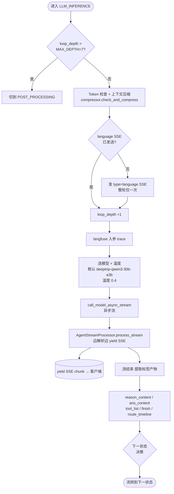

### 8.1 推理前 5 件事

```python
# 8.1.1 深度检查
if self.context.loop_depth > self.MAX_DEPTH:
    self.current_state = LoopState.POST_PROCESSING
    return

# 8.1.2 Token 检查 + 上下文压缩
compressor = get_compressor()
self.llm_inference_messages, was_compressed, compression_stats = \
    compressor.check_and_compress(self.llm_inference_messages, sid)

# 8.1.3 language SSE：整次对话只发一次
if not self.language_message_sent:
    usr_language_code = self._get_current_usr_language_code()
    if usr_language_code:
        order = json.dumps({"best_match_lang": usr_language_code, ...})
        yield "data: " + json.dumps({"type":"language","text":order}) + "\n\n"
        self.language_message_sent = True

# 8.1.4 增加 loop_depth
self.context.increment_loop_depth()

# 8.1.5 langfuse 记录入参
self.context.langfuse.model_input_trace(loop_depth, messages, model_name)
```

### 8.2 选模型 & 温度

```python
temperature = 0.4
if last_agent_state in (DEEP_THINK, CHECK_THINK, SUMMARY_THINK):
    only_thinking = True
    temperature = None
else:
    only_thinking = False

if route == "inspiration_agent":
    if not only_thinking:
        temperature = 0.65                       # 灵感场景适度提温
    self.llm_model_name = ("glm-5" if 非中文 else "deepseek-v3.2")
```

### 8.3 调模型 + 流式解析

```python
rsp = call_model_async_stream(                      # 异步流接口
    model_name=self.llm_model_name,
    messages=self.llm_inference_messages,
    message_id=self.context.message_id,
    session_id=self.context.session_id,
    temperature=temperature,
    only_thinking=only_thinking,
)

if not self.processor:
    self.processor = AgentStreamProcessor(
        context=self.context,
        item_recs=self.item_recs,
        thinking_threshold=200,
        thinking_early_threshold=100,
        thinking_min_length=10,
        enable_metrics=True,
    )
    self.processor.reset()
else:
    self.processor.reset()

async for result in self.processor.process_stream(rsp):
    processed_result = self._post_process_output(result)   # 附加 ans_lang 等
    yield processed_result
```

### 8.4 推理结束后的"标签提取"

```python
reason_content = self.processor.state.reason_content       # <think>... 区
ans_content    = self.processor.state.ans_content          # 最终回答

# 提取工具调用 / route_timeline / finish blocks
if '<route_timeline>' in reason_content:
    self.context.route_timeline = re.findall(r'<route_timeline>(.*?)</route_timeline>', reason_content, re.DOTALL)

tool_id_list = thinking_fsm_processor.fsm_context.get('tool_id_list', [])
tool_list    = thinking_fsm_processor.fsm_context.get('tool_list', [])
self.context.tool_list.extend(tool_list)
self.context.tool_id_list.extend(tool_id_list)
thinking_fsm_processor.fsm_context['tool_id_list'] = []   # 重置（按轮次累积）

self.context.finish_blocks = re.findall(r'<finish>(.*?)</finish>', reason_content, re.DOTALL)
self.context.langfuse.main_step_trace(loop_depth, "assistant",
                                       reason_content+ans_content, "answer_model")

if "<abandon_recommend>" not in reason_content:
    self.context.reasoning_tracker.add_agent_answer(reason_content+ans_content, round_number=current_round_id)
```

### 8.5 标签 → 下一状态映射（决策表）

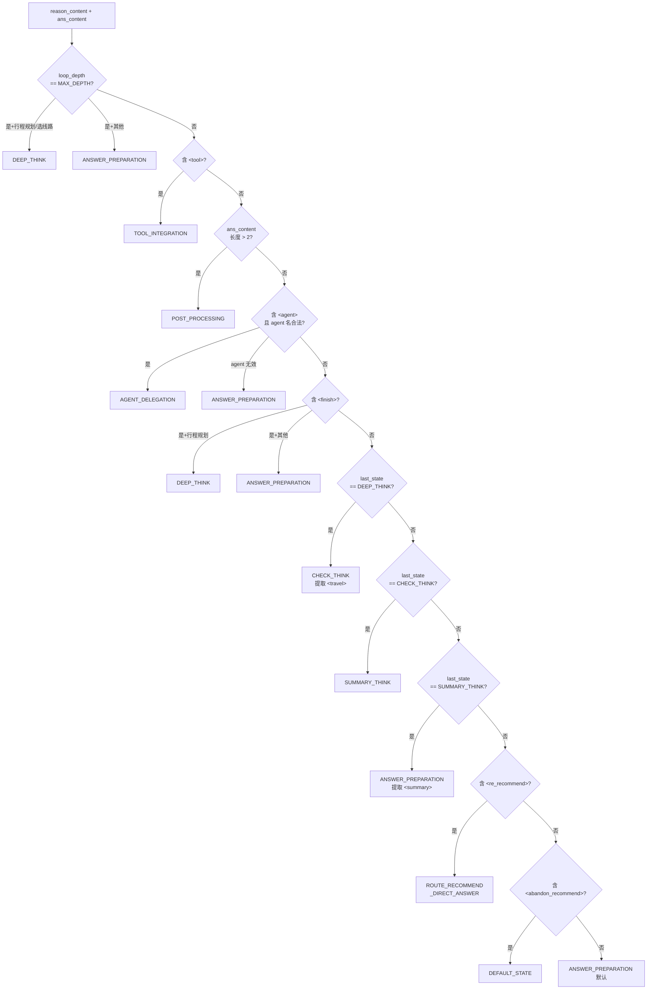

| 条件 | 下一状态 | 备注 |
|---|---|---|
| `loop_depth == MAX_DEPTH` 且 `route == route_planning_agent` 或选了线路 | `DEEP_THINK` | 进入深度思考链 |
| `loop_depth == MAX_DEPTH`（其他） | `ANSWER_PREPARATION` | 深度封顶兜底 |
| `<tool>` in reason_content | `TOOL_INTEGRATION` | 模型要求调工具 |
| `len(ans_content) > 2` | `POST_PROCESSING` | 已经出回答 |
| `<agent>...</agent>` 且 agent 名合法 | `AGENT_DELEGATION` | 委派子 agent |
| `<agent>` 但 agent 无效 | `ANSWER_PREPARATION` | 兜底 |
| `<finish>` 出现 且 `route == route_planning_agent` | `DEEP_THINK` | 行程规划进入深思考 |
| `<finish>` 出现（其他） | `ANSWER_PREPARATION` | |
| `last_agent_state == DEEP_THINK` | `CHECK_THINK` | 提取 `<travel>` 内容 |
| `last_agent_state == CHECK_THINK` | `SUMMARY_THINK` | |
| `last_agent_state == SUMMARY_THINK` | `ANSWER_PREPARATION` | 提取 `<summary>` 内容 |
| `<re_recommend>` | `ROUTE_RECOMMEND_DIRECT_ANSWER` | 重新推荐线路 |
| `<abandon_recommend>` | `DEFAULT_STATE` | 放弃此轮，回默认 |
| 其他 | `ANSWER_PREPARATION` | 默认走答案准备 |

> Java 类比：等价于一个超大的 `switch(...)` 路由，依据上一轮的"标签产物"决定下一步策略。

---

## 9. `AgentStreamProcessor`：流解析与 FSM 体系

文件：
- 基类 `app/routers/agent_stream_processer/base_processor.py`
- 子类 `app/routers/agent_stream_processer/agent_stream_processor.py`

### 9.1 数据流结构

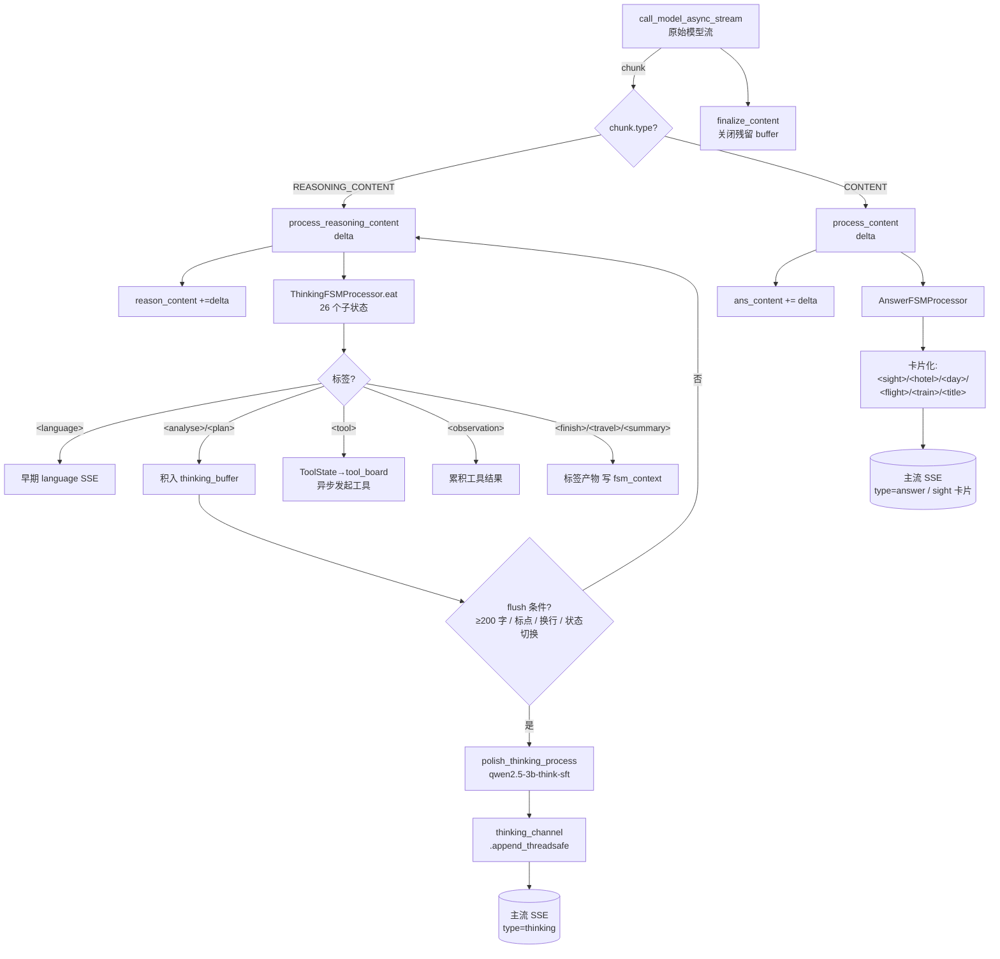

### 9.2 `process_stream` 主循环

`base_processor.py` 中 `process_stream(self, raw_stream)`：

1. 调 `_init_state()` 初始化 `self.state`（包含 `reason_content`、`ans_content`、`thinking_buffer`、`thinking_fsm_processor`、`answer_fsm_processor`、`all_thinking_message`、`finished` 等）。
2. `async for chunk in raw_stream:` 拉一条原始流。
3. 按 `chunk.type` 分发：
   - `REASONING_CONTENT` → `await self.process_reasoning_content(delta)`
   - `CONTENT` → `await self.process_content(delta)`
4. `await self.finalize_content()` 收尾（处理残留 buffer、关闭 fsm）。

### 9.3 ThinkingFSMProcessor 的 26 个子状态

`agent_stream_processor.py:189` 的 `_init_thinking_fsm_processor` 注册了 26 个子 state，每个对应一个 XML 标签的处理器。常见标签：

| 标签 | 用途 | 状态类 |
|---|---|---|
| `<language>` | 语言识别（早期触发 language SSE） | LanguageState |
| `<analyse>` | 分析说明 | AnalyseState |
| `<plan>` | 推理计划 | PlanState |
| `<tool>` | 工具调用（含 name、parameters） | ToolState |
| `<observation>` | 工具调用结果观察 | ObservationState |
| `<finish>` | 推理完成 | FinishState |
| `<freethink>` | 自由思考片段 | FreethinkState |
| `<travel>` | 行程规划深思考产物 | TravelState |
| `<summary>` | 总结思考产物 | SummaryState |
| `<re_recommend>` | 重新推荐 | ReRecommendState |
| `<abandon_recommend>` | 放弃推荐 | AbandonRecommendState |
| `<route_timeline>` | 行程时间线 | RouteTimelineState |
| `<agent>` | 委派 agent | AgentState |
| ... | 其余共 26 类 | ... |

每个 state 共享一个 `fsm_context` dict，里面挂 `tool_board`、`NAME_2_TOOL`、`NAME_2_MEM`、`item_recs`、`tool_list`、`tool_id_list` 等。

### 9.4 思考打磨（polish）触发条件

`process_reasoning_content`：

```python
self.state.reason_content += delta
self.state.thinking_fsm_processor.eat(delta)        # 推进 FSM
self.state.thinking_buffer += polished_text         # 累积待 polish 的明文
if self._should_flush_thinking_buffer():
    await self._flush_thinking_buffer()             # ← 触发 polish + append 到通道
```

flush 触发条件（任意一个满足）：
- 累积长度 ≥ 200 字符
- 遇到中文句号 / 问号 / 换行（自然停顿）
- FSM 状态收尾切换（如 `<analyse>` → `</analyse>`）

`_flush_thinking_buffer` → 调 `polish_thinking_process(model="qwen2.5-3b-think-sft", ...)` 做润色，结果通过 `thinking_channel.append_threadsafe(...)` 推给主线程的 SSE 流。

> Java 类比：等价于一个"流式 SAX 解析器"：边收 token 边切换状态、累积内容；过段、过标点 flush 一次到 sink。

### 9.5 AnswerFSMProcessor 的卡片化

`process_content` 走 `answer_fsm_processor`，把 `<sight>`、`<hotel>`、`<day>`、`<title>`、`<flight>`、`<train>` 等业务标签转成结构化卡片 HTML（最终给前端渲染）。

---

## 10. `ThinkingChannel`：跨线程思考通道

文件：`app/routers/agent_loop/thinking_channel.py`

### 10.1 设计目的

Agent 主线程会产出大量"中间思考"内容，这些不应在主流上无缝输出，而是经过 polish 后单独以 `thinking` 类型 SSE 推出。但 `process_stream` 是在 Agent 线程里跑的，主事件循环又不能阻塞——所以需要一个跨线程通道。

### 10.2 接口

| 方法 | 用法 | 实现 |
|---|---|---|
| `append(text)` | 同步追加（在主线程里） | 直接 `asyncio.Queue.put_nowait` |
| `append_threadsafe(text)` | 跨线程追加（Agent 线程内调用） | `loop.call_soon_threadsafe(queue.put_nowait, ...)` |
| `iterate()` | 主线程异步遍历 | `async def iterate(): while not done: yield await queue.get()` |
| `close()` | 关闭通道 | 推入哨兵 |
| `set_language_code(code)` | 设语言，后续 append 自动翻译 | 内部翻译 hook |

> Java 类比：等价于 `Sinks.Many<T>.unicast()`，在另一个线程里 `tryEmitNext`，主流在 Project Reactor 里订阅。

### 10.3 在 `merged_stream` 中的接入

```python
async def pump_thinking():
    async for item in thinking_channel.iterate():
        data = "data: " + json.dumps({"type":"thinking", "text": item.get("text","")}) + "\n\n"
        await out_queue.put(data)
```

→ 思考流和 Agent 主流合并到同一个 `out_queue`，再被 `merged_stream` 的循环 yield 出去。

---

## 11. 工具整合：`_handle_tool_integration_state`

`DT_agent_loop_v2.py:3026+`

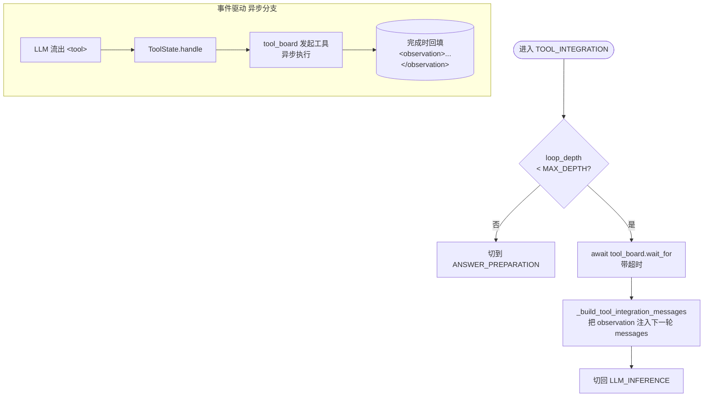

工具调用是"事件驱动"的：
- LLM 输出 `<tool>{"name":"...","parameters":{...}}</tool>` 时，`ToolState.handle()` 立刻把任务推给 `tool_board`（异步执行）。
- `_handle_tool_integration_state` 进来后只是"等结果"，不阻塞流式输出。
- `tool_board` 完成的工具结果会以 `<observation>...</observation>` 形式写进下一轮 messages。

---

## 12. 终止处理：`_handle_post_processing_state`

`DT_agent_loop_v2.py:3753-3950+`，做 6 件事：

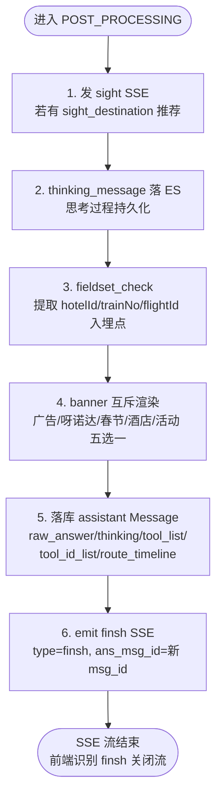

`finsh` SSE 在整个代码里有 12 个发送点，对应不同终止路径，但都是同一个语义：**结束**。

---

## 13. SSE 输出格式

> **拼写说明**：流里 `type=finsh` 是源码历史遗留字面量（少了一个 `i`，**正确拼写应是 `finish`**），但仓库代码里所有发送点和前端识别都按 `finsh` 走，因此本文档凡引用该字段值或类型名时，一律按代码原样写 `finsh`，描述性文字提到含义时使用"结束/finish 信号"。

主流上会出现以下几类 SSE chunk（前端要按 `type` 分发）：

```jsonc
// 1. 语言识别（整轮一次）
{"type":"language","text":"{\"best_match_lang\":\"zh-CN\",\"sid\":\"...\",\"user_msg_id\":\"...\"}"}

// 2. 思考流（来自 thinking_channel）
{"type":"thinking","text":"### 用户在问 ... \n#### 我打算 ..."}

// 3. 答案流（直出 / 卡片 HTML）
{"type":"answer","text":"<sight>...</sight>"}
{"type":"answer","text":"<h2>推荐方案</h2>..."}

// 4. 工具进度（部分场景）
{"type":"thinking","text":"🔄 机票助手无法处理，正在转交主流程..."}

// 5. 景点推荐（结构化）
{"type":"sight","text":"...JSON..."}

// 6. 结束（必发）
{"type":"finsh","text":"ok","ans_msg_id":"abc123"}
```

Header：`queryId: <user_msg_id>`，前端拿去做重连参数。

---

## 14. 关键依赖与外部资源

| 资源 | 用途 |
|---|---|
| **Redis ×2** | 会话状态 / `latest_user_msg_id` / 工具记忆缓存 / 限流 |
| **ES（4 索引）** | 对话消息 / 行程持久化 / 用户画像 / 思考过程 |
| **Milvus** | 用户长期记忆（话术驱动写入 + 语义检索） |
| **Baidu API** | 位置 / POI 解析 |
| **Langfuse** | 全链路 trace（输入 messages、模型输出、耗时、错误） |
| **MQ** | 异步落 Message（保证 SSE 不阻塞主流） |
| **LLM 模型** | `qwen3-next-80b-a3b-instruct`（分析）/ `deepseek-v3.2`（旅行规划/灵感中文）/ `deeptrip-qwen3-30b-a3b`（主推理）/ `qwen2.5-3b-think-sft`（思考润色）/ `glm-5`（灵感非中文） |

---

## 15. 全景时序图

```mermaid
sequenceDiagram
    autonumber
    participant FE as 前端
    participant H as chat_handler主事件循环
    participant AL as AgentLoop
    participant AT as AgentLoopThread独立事件循环
    participant TC as ThinkingChannel
    participant Q as 跨线程队列_out_queue
    participant LLM as 模型/工具

    FE->>H: POST /chat<br/>携带 params + headers 发起对话
    H->>AL: new AgentLoop(...)<br/>构造一次会话的状态机对象
    AL->>AL: pre_initialize 同步预初始化
    Note over AL: init_dt_context 解析 header/params 建上下文<br/>build user Message 组装用户消息对象<br/>insert_conversation_msg 写 ES + MQ 落库<br/>kv_save latest_user_msg_id 写 Redis 记最近消息 ID
    H->>TC: new ThinkingChannel<br/>建跨线程"思考流"通道
    H->>AT: 启动 AgentLoopThread daemon<br/>把 Agent 重活搬到独立线程跑

    par Agent 主流(干重活)
        AT->>AL: agent_loop.initialize 异步初始化
        Note over AL: ItemRecs init 加载推荐数据源 Redis 缓存<br/>_initialize_prompts 模块化拼装 prompt<br/>_sync_user_memory Milvus 长期记忆 先写后查<br/>_analyze_user_query 7 任务并发分析<br/>语言/意图/广告/改写/路由/搜索/洞察<br/>_determine_hotel_agent_route 酒店 agent 分流判定<br/>客服 dispatch 判定 是否转人工
        AT->>AL: agent_loop.run 进入主循环
        Note over AL: 状态机起点 由 initialize 选出<br/>普通对话→DEFAULT_STATE<br/>命中子 agent→对应专属状态
        loop while True 状态机驱动 (loop_depth+1 每轮)
            rect rgb(40,60,90)
            Note over AL: 【DEFAULT_STATE】准备阶段<br/>选 prompt / 选模型 / 拉搜索 rerank<br/>state := LLM_INFERENCE
            end
            rect rgb(35,80,55)
            Note over AL: 【LLM_INFERENCE】核心推理
            AL->>LLM: call_model_async_stream<br/>发起一次模型流式推理
            LLM-->>AL: REASONING_CONTENT / CONTENT chunks<br/>边想边吐 token
            AL->>AL: AgentStreamProcessor 双 FSM 解析
            Note over AL: ThinkingFSM 识别 tool/finish/agent/travel 标签<br/>AnswerFSM 把 sight/hotel 转卡片 HTML
            AL-->>Q: cross_thread_queue.put_nowait chunk<br/>把 SSE chunk 投到跨线程队列
            Note over AL: 流结束后看标签产物决定下一状态:<br/>有 tool → TOOL_INTEGRATION<br/>有 agent → AGENT_DELEGATION (终态)<br/>有 finish/ans → ANSWER_PREPARATION<br/>行程规划+finish → DEEP_THINK<br/>depth>MAX=7 → ANSWER_PREPARATION 兜底
            end
            alt 需要调工具
                rect rgb(110,75,25)
                Note over AL: 【TOOL_INTEGRATION】等工具
                AL->>AL: await tool_board.wait_for<br/>等所有 tool 异步结果
                AL->>AL: 拼 observation 进下一轮 messages<br/>state := LLM_INFERENCE 回到推理
                end
            else 行程规划深思考链
                rect rgb(80,50,110)
                Note over AL: 【DEEP_THINK → CHECK_THINK → SUMMARY_THINK】<br/>三段式深规划 产出 travel/summary 标签<br/>最终 state := ANSWER_PREPARATION
                end
            else 委派子 agent
                rect rgb(120,45,55)
                Note over AL: 【AGENT_DELEGATION / FLIGHT/HOTEL/TRAIN_AGENT】<br/>子 agent 自行 yield SSE<br/>正常完成 → POST_PROCESSING<br/>fallback → 回 DEFAULT_STATE 继续主流程
                end
            else 出最终答案
                rect rgb(50,55,95)
                Note over AL: 【ANSWER_PREPARATION】整理最终 messages<br/>state := POST_PROCESSING
                end
            end
        end
        rect rgb(30,90,80)
        Note over AL: 【POST_PROCESSING】终态收尾 6 步<br/>1.sight SSE 2.thinking 落 ES<br/>3.fieldset_check 埋点 4.banner 五选一<br/>5.assistant Message 落库 6.发 finsh SSE
        end
        AL-->>Q: 投送哨兵 __agent_done__ True<br/>通知主线程 Agent 跑完了
    and Thinking 旁路(打磨思考流)
        AL->>TC: append_threadsafe polished text<br/>润色后的"思考"片段跨线程推到通道
    and 主事件循环搬运(轻活/不阻塞)
        H->>Q: pump_agent 从 pyqueue 搬到 asyncio.Queue<br/>桥接"线程世界→协程世界"
        H->>TC: pump_thinking 遍历思考通道<br/>包成 type=thinking 投入 out_queue
        H->>FE: merged_stream yield SSE chunk<br/>StreamingResponse 写 TCP socket
        Note over H,FE: 客户端收到顺序<br/>language → thinking → answer/卡片 → finsh
    end

    AL->>TC: close<br/>Agent 完结后关闭思考通道
    H-->>FE: 流结束 finsh ok<br/>前端识别 finsh 后正式断流
```

---

## 16. 心智地图：6 个最关键的"理解点"

1. **接口入口很薄**：`POST /chat` 只是个壳，所有逻辑都在 `DT_agent_loop_v2`。
2. **双流合并是核心架构**：Agent 跑在另一个线程的独立事件循环里，主事件循环只负责输出 SSE 和搬运消息。
3. **AgentLoop 同步段 + 异步段**：`pre_initialize`（同步：建 context、落库 user msg）→ `initialize`（异步：7 任务并发、用户记忆）→ `run`（异步生成器，状态机循环）。
4. **路由识别是分流总开关**：`route_manager_result` 决定走哪个子 agent 或主循环；fallback 机制保证子 agent 失败能回退主流。
5. **流式 FSM 是答案构造的灵魂**：模型边出 token 边被 `ThinkingFSMProcessor`（26 子状态）和 `AnswerFSMProcessor` 解析，思考流润色后异步推到前端，答案流变成卡片。
6. **`MAX_DEPTH=7` 是熔断**：每轮 LLM 推理就 `loop_depth +1`，超 7 强制走输出兜底，避��死循环。

---

## 17. 入门建议路径（给新接手的 Java 同学）

1. 先把 §1（入口）+ §6（状态机）当作"地图"通读一遍。
2. 用 IDE 跳到这几行立刻建立锚点：
   - `app/routers/api.py:177` `/chat` 路由
   - `app/routers/agent_loop/DT_agent_loop_v2.py:4164` `DT_agent_loop_v2`
   - `DT_agent_loop_v2.py:103` `AgentLoop.__init__`
   - `DT_agent_loop_v2.py:164` `pre_initialize`
   - `DT_agent_loop_v2.py:199` `initialize`
   - `DT_agent_loop_v2.py:2064` `run`
   - `DT_agent_loop_v2.py:2749` `_handle_llm_inference_state`
   - `DT_agent_loop_v2.py:3753` `_handle_post_processing_state`
   - `app/routers/llm_functions/analyze_query_comprehensive.py:94` 7 任务并发
   - `app/routers/agent_stream_processer/agent_stream_processor.py:189` FSM 26 子状态注册
3. 跑一次本地链路（参考 `chat-smoke-test` skill），观察 SSE 输出 chunk 的类型顺序：language → thinking → answer/cards → finsh。
4. 选一个具体业务支线深挖：建议从 `flight_agent`、`hotel_agent`、`travel_plan_agent` 任选一个，对照 §6.2 / §6.3 看它的 `_handle_*_state`。

---

> **作者备注**：本文档以源码 + 真实日志双锚，专门为 Java 背景同学加了大量类比说明。**所有行号以读时仓库为准**（`agent-b101` 仍在演进），如发现行号漂移以"类名 + 方法名 + 关键字符串"为准定位。

---

## 18. 用户视角 SSE 信息流（独立文档）

抛开内部状态机、纯粹站在前端/用户角度看 `/chat` 流的实例分析（"北京三日游"全文 SSE 解构 + Day1/Day2/Day3 完整时段表）已抽到独立文档：

> 📄 [`用户视角SSE信息流_北京三日游_DOC.md`](./用户视角SSE信息流_北京三日游_DOC.md)

内容包括：
- chunk 类型分布（thinking 21 / answer 715 / sight 1 / finish 2）
- 用户视角概要流程图（mermaid，含 Day1~Day3 全部时段方块）
- 用户感知的 4 个阶段
- 三日游完整时段表（按真实日志还原）
- 关键观察（MAX_DEPTH 熔断、两条 finish 的语义、a 标签多端适配等）
