# 用户视角 SSE 信息流（"北京三日游"实例）

> **配套阅读**：`chat接口核心流程源代码分析_DOC.md`（源码版）。本文档抛开内部状态机，纯粹站在 **前端 / 用户** 角度看 `/chat` 流。
>
> **样本日志**：`日志/北京三日游响应.txt`
> **请求**：`POST /chat` body `{"sid":"test123","q":"北京三日游"}`，无 memberId（test_user）
> **响应总长**：1483 行 SSE

---

## 1. 全文 chunk 类型分布

| 类型 | 数量 | 用户能看到的形态 |
|---|---|---|
| `thinking` | **21** | 头部气泡里的"思考过程"动画（润色后的短句） |
| `answer` | **715** | 主回答正文（流式打字 + 内嵌酒店 / 景点 / 打车 a 标签卡片） |
| `sight` | 1 | 景点推荐区结构化数据（前端独立渲染） |
| `finish`（流里字面是 `finsh`，下同） | 2 | 流终止信号（首条 `max_depth_reached` 兜底，末条带回归 flag 元数据） |

> **拼写说明**：响应里 `type=finsh` 是历史遗留字面量（少了一个 `i`），代码里到处都是这个写法，前端按字面识别。本文描述性文字一律写正确拼法 **finish**，仅在引用真实字段值时保留 `finsh`。

> 内嵌卡片：酒店链接 5 处、景点链接 16 处、打车链接 8 处，全部以 `<a class="*-link-name">` 形式拼在 `answer` chunk 里，前端按 `class` 分发样式与跳转 schema。

---

## 2. 用户视角概要流程图

```mermaid
flowchart TD
    U([用户输入: 北京三日游]) --> P[POST /chat]
    P --> S{{SSE 流开始}}

    S --> T1[💭 思考气泡<br/>分析用户需求 / 设计旅行路线]
    T1 --> T2[🔍 思考气泡<br/>正在搜索相关信息...]
    T2 --> T3[💭 思考气泡<br/>查询酒店 / 查询交通 / 搜索景点]
    T3 --> T4[💭 思考气泡<br/>检查行程→发现冲突→优化调整<br/>共 18 条思考动画轮播]

    T4 --> A0[📝 answer 流开始<br/>逐字打字效果]

    subgraph Header[行程总览块]
      H1[# 古都京韵·北京皇城三日游]
      H2[📅 2026-05-12 → 05-14]
      H3[🗺 路线: 天安门→故宫→景山→...]
      H4[🏨 住宿卡片<br/>北京华旅宾馆 a 标签 跳酒店详情]
      H5[🚕 打车卡片<br/>同程旅行打车 a 标签]
      H6[☀️ 天气 / 👥 人群 / 主题]
    end
    A0 --> Header

    subgraph Day1[Day1 紫禁城中轴线巡礼]
      D1a[# 06:30-07:30 市内交通<br/>含 天安门广场 景点 a 标签]
      D1b[# 07:30-09:00 游览景点<br/>升旗+天安门]
      D1c[# 09:00-10:00 市内交通<br/>前往故宫]
      D1d[# 10:00-14:00 游览景点<br/>故宫深度游]
      D1e[# 14:00-14:30 午餐]
      D1f[# 14:30-15:30 游览景点<br/>景山公园]
      D1g[# 15:30-16:30 市内交通<br/>前往前门大街]
      D1h[# 16:30-19:00 游览景点<br/>前门 / 王府井]
      D1i[# 19:00-19:45 市内交通<br/>返酒店]
      D1j[# 19:45-21:00 自由活动]
    end
    Header --> Day1

    subgraph Day2[Day2 天坛祈福·胡同文脉]
      D2a[# 07:30-08:30 早餐<br/>酒店中式简餐]
      D2b[# 08:30-09:30 市内交通<br/>地铁/打车至天坛东门]
      D2c[# 09:30-12:00 游览景点<br/>天坛: 祈年殿/回音壁/圜丘坛]
      D2d[# 12:00-13:00 午餐<br/>炸酱面/豆汁儿/卤煮]
      D2e[# 13:00-14:00 市内交通<br/>前往雍和宫]
      D2f[# 14:00-15:30 游览景点<br/>雍和宫: 大雄宝殿/万福阁]
      D2g[# 15:30-16:30 游览景点<br/>国子监街/孔庙/国子监]
      D2h[# 16:30-18:00 游览景点<br/>五道营胡同 文创小巷]
      D2i[# 18:00-19:00 餐饮<br/>京味私房菜]
      D2j[# 19:00-19:45 市内交通<br/>返酒店]
      D2k[# 19:45-21:00 自由活动]
    end
    Day1 --> Day2

    subgraph Day3[Day3 皇家园林]
      D3a[# 07:30-08:30 早餐<br/>酒店清淡粥品]
      D3b[# 08:30-09:30 市内交通<br/>前往颐和园北宫门]
      D3c[# 09:30-12:00 游览景点<br/>颐和园 长廊/佛香阁/昆明湖]
      D3d[# 12:00-12:45 午餐<br/>颐和园听鹂馆 宫廷菜]
      D3e[# 12:45-13:45 市内交通<br/>前往圆明园]
      D3f[# 13:45-15:15 游览景点<br/>圆明园 大水法/西洋楼遗址]
      D3g[# 15:15-16:30 市内交通<br/>打车去机场/西站]
      D3h[# 16:30-18:00 候机/候车]
      D3i[# 18:00 返程出发]
    end
    Day2 --> Day3

    Day3 --> Tail[# ✈️ 行前准备<br/># 🍂 季节天气注意事项<br/># 🎒 装备清单<br/># 📞 售后服务]
    Tail --> SI[🎯 sight chunk<br/>结构化景点推荐 前端独立 UI]
    SI --> F1[🏁 finish 1<br/>text=max_depth_reached<br/>主流程兜底信号]
    F1 --> TF[💭 末尾 3 条 thinking<br/>补充规划说明 用户继续看到]
    TF --> F2[🏁 finish 2<br/>携带元数据:<br/>need_recommend / has_travel_plan / ...<br/>前端关闭流]
    F2 --> End([用户最终看到完整三日游攻略])

    classDef think fill:#3a3050,stroke:#8a7ab0,color:#eee
    classDef ans fill:#1f3a4d,stroke:#5a8aa8,color:#eee
    classDef terminal fill:#3a2030,stroke:#a55070,color:#eee
    classDef header fill:#2a4a3a,stroke:#5a9a7a,color:#eee
    class T1,T2,T3,T4,TF think
    class Header,Day1,Day2,Day3,Tail ans
    class SI,F1,F2 terminal
    class S header
```

---

## 3. 用户感知的 4 个阶段

| 阶段 | SSE 类型 | 用户体感 |
|---|---|---|
| 1️⃣ 思考预热 | 18 条 `thinking` | 顶部气泡轮播"分析需求 / 搜索 / 查酒店 / 查景点 / 检查冲突 / 优化"，让人感觉"AI 真的在干活" |
| 2️⃣ 正文打字 | 715 条 `answer` | 行程总览 → Day1/Day2/Day3 三大块，每块按时间段 `# HH:MM-HH:MM` 切片，行内嵌入酒店 / 景点 / 打车点击卡片，末尾还有"行前准备 / 装备清单 / 售后服务"四节 |
| 3️⃣ 推荐补强 | 1 条 `sight` | 答案下方"为你推荐"景点流，独立 UI 渲染 |
| 4️⃣ 收尾 + 回访 | 2 条 `finish` + 末尾 3 条 `thinking` | 第一个 `finish=max_depth_reached` 是熔断兜底；之后还会再吐 3 条 thinking 做兜底解释；末尾 `finish` 带 `has_travel_plan / need_recommend` 等 flag，前端据此渲染下一轮的引导按钮 |

---

## 4. 完整三日游时段表（按真实日志还原）

> 标题来自 715 条 `answer` chunk 拼接后的 `# HH:MM-HH:MM` 段落；卡片栏统计该时段内出现的 `<a class>` 类型。

### Day 1 🌅 晨曦升旗 · 紫禁城中轴线巡礼

| 时段 | 类型 | 主要内容 | 内嵌卡片 |
|---|---|---|---|
| 06:30–07:30 | 市内交通 | 前往天安门广场观看升旗 | 景点·天安门 |
| 07:30–09:00 | 游览景点 | 天安门广场 / 人民英雄纪念碑 / 毛主席纪念堂 | 景点·天安门 |
| 09:00–10:00 | 市内交通 | 步行至故宫午门 | — |
| 10:00–14:00 | 游览景点 | 故宫博物院 三大殿 / 御花园 深度游 | 景点·故宫 |
| 14:00–14:30 | 午餐 | 故宫附近老北京炸酱面 / 烤鸭 | — |
| 14:30–15:30 | 游览景点 | 景山公园 万春亭俯瞰中轴线 | 景点·景山 |
| 15:30–16:30 | 市内交通 | 前往前门大街 | 打车 |
| 16:30–19:00 | 游览景点 | 前门大街 / 大栅栏 / 王府井 | 景点·前门 / 王府井 |
| 19:00–19:45 | 市内交通 | 返回酒店 | 打车 |
| 19:45–21:00 | 自由活动 | 酒店休息 / 整理照片 | — |

### Day 2 🪔 天坛祈福 · 胡同里的文脉回响

| 时段 | 类型 | 主要内容 | 内嵌卡片 |
|---|---|---|---|
| 07:30–08:30 | 早餐 | 酒店中式简餐：粥 / 包子 / 豆浆 | 酒店·华旅宾馆 |
| 08:30–09:30 | 市内交通 | 地铁 5 号线转 14 号线至天坛东门，或打车直达 | 景点·天坛 / 打车 |
| 09:30–12:00 | 游览景点 | **天坛公园**：祈年殿 / 皇穹宇 / 圜丘坛 / 回音壁，体验"天圆地方"和声学奇迹 | 景点·天坛 |
| 12:00–13:00 | 午餐 | 天坛南门附近老北京风味：炸酱面 / 豆汁儿配焦圈 / 卤煮火烧 | — |
| 13:00–14:00 | 市内交通 | 打车至雍和宫站 | 打车 |
| 14:00–15:30 | 游览景点 | **雍和宫**：大雄宝殿 / 万福阁 / 永佑殿，26 米铜铸弥勒佛，汉藏融合建筑 | 景点·雍和宫 |
| 15:30–16:30 | 游览景点 | 步行至 **国子监街**，参观孔庙与国子监辟雍殿 | — |
| 16:30–18:00 | 游览景点 | **五道营胡同**：咖啡馆 / 文创店 / 艺术涂鸦墙打卡 | 景点·五道营 |
| 18:00–19:00 | 餐饮 | 五道营胡同京味私房菜：干烧黄鱼 / 京酱肉丝 / 炸灌肠 | — |
| 19:00–19:45 | 市内交通 | 打车返回酒店 | 酒店 / 打车 |
| 19:45–21:00 | 自由活动 | 酒店茶室品茶 / 整理照片 | — |

### Day 3 🌊 皇家园林 · 湖光山色中的历史回响

| 时段 | 类型 | 主要内容 | 内嵌卡片 |
|---|---|---|---|
| 07:30–08:30 | 早餐 | 酒店清淡粥品，为徒步储备能量 | 酒店·华旅宾馆 |
| 08:30–09:30 | 市内交通 | 打车 12 公里至颐和园北宫门 | 景点·颐和园 / 打车 |
| 09:30–12:00 | 游览景点 | **颐和园**：长廊（七千余幅彩绘）/ 佛香阁 / 昆明湖泛舟 / 十七孔桥 / 石舫 | 景点·颐和园 |
| 12:00–12:45 | 午餐 | 园内"听鹂馆"宫廷菜：松鼠鳜鱼 / 清蒸鲥鱼，临湖用餐 | — |
| 12:45–13:45 | 市内交通 | 打车至圆明园 | 景点·圆明园 / 打车 |
| 13:45–15:15 | 游览景点 | **圆明园遗址公园**：大水法 / 远瀛观 / 西洋楼遗址，租讲解器了解十二生肖兽首 | 景点·圆明园 |
| 15:15–16:30 | 市内交通 | 打车前往首都机场（30 公里 / 60–90 分钟）或北京西站（10 公里 / 30 分钟） | 打车 |
| 16:30–18:00 | 候机 / 候车 | 办理登机或乘车手续 | — |
| 18:00 | 返程 | 结束北京三日文化之旅 | — |

### 行程后附加信息

`Day3` 之后还有 4 个 `#` 段，是攻略型尾巴：

- `# ✈️ 行前准备`（证件 / 预约 / APP 安装等）
- `# 🍂 季节与天气注意事项`（5 月 12–14 日晴 30/17℃，防晒补水）
- `# 🎒 装备清单`（防晒帽 / 舒适步行鞋 / 充电宝）
- `# 📞 售后服务`（同程客服入口）

---

## 5. 关键观察

- **本次响应触发了 `MAX_DEPTH=7` 熔断**：第一个 `finish` 文本是 `max_depth_reached`，对应源码版文档 §8 中"超过 7 轮 LLM 推理强制走兜底"。但用户其实**已经拿到完整答案**——熔断不影响内容质量，只是循环到点强制收尾。
- **两条 `finish` 不冲突**：第一条是熔断信号；第二条是 `_handle_post_processing_state` 标准收尾（带 `ans_msg_id` 占位 + 元数据 flag），前端**只需识别"出现 finish"**就关闭流，不区分文本内容。
- **`thinking` 在 `answer` 之后还会再出现**（行号 1472/1474/1476）：因为内部仍有 1~2 轮深思考链在补流，但前端拿到 `finish` 即应停止渲染（避免错位）。
- **卡片靠 `<a class>` 解耦**：`hotel-link-name` / `sight-link-name` / `taxi-link-name` 三类 a 标签嵌在 `answer` 文本流里，每个 a 标签同时挂 `data-pc` / `data-applet` / `data-mainMiniApp` / `data-tcapp` / `data-elapp` / `data-cstMiniApp` 等多套 schema，前端拦截 click 事件按当前渠道（PC / 小程序 / TC App / EL App / 春秋小程序…）跳对应 schema。**同一份 SSE 适配多端**。
- **answer chunk 切得很碎**（715 条 / Day3 一段标题甚至被切成 `# 12:45` + `-13:45` + ` 市内交通` 三块）：这是 LLM token 流式输出的天然结果，前端按字符串拼接渲染即可，无需关心 chunk 边界。
